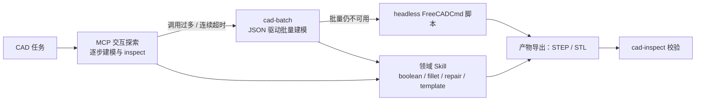

# Plugin hardware

## 模块定位

硬件与嵌入式工程：电路/PCB/CAD/固件相关 Skill 的归置插件。当前落地的是机械 CAD 这一支
（`cad-*` 七个 Skill，原独立插件 `freecad` 于 2026-10-05 并入本插件）。

## 能力结构

- `cad-core/`：FreeCAD document、primitive、boolean、transform、array、export 和 inspect 基础函数。
- `cad-batch/`：JSON 驱动的批量建模兜底路径。
- `cad-boolean/`、`cad-fillet/`、`cad-inspect/`、`cad-repair/`、`cad-template/`：领域工作流 Skill 与脚本。
- `plugin.md`：工具过滤（include 白名单）、FreeCAD MCP 声明和整体操作策略。

推荐顺序是 MCP 交互探索，调用过多或连续超时时切换 batch，最后才使用 headless FreeCADCmd 脚本。

## 降级链



## 工具面口径（继承自 `freecad`）

激活本插件时工具面按 `plugin.md` 的 include 收窄为：`switch_plugin`、`switch_mode`、`get_time`、
`read_file`、`grep_search`、`glob`、`write*`、`edit*`、`bash`（外加本插件声明的 MCP 工具）。
后续往本插件加固件/电路类 Skill 时，若它们需要 browser / computer use / 后台作业面，
应同步扩这条白名单，否则那些工具在插件激活态下不可见。

## 当前风险

`plugin.md` 中 MCP command 仍包含开发机绝对路径，这是不可移植配置；跨平台发行前应改为环境变量、
PATH discovery 或用户配置。README 和示例不得复制个人路径作为推荐值。

## Review

- 脚本是否 headless、确定性并显式输出产物路径。
- 循环中避免频繁 recompute；批量 primitive 后统一 fuse/recompute。
- MCP timeout 不等于建模失败，fallback 不能重复产生冲突对象。
- 输入 JSON、输出 STEP/STL 和临时文件必须限制在 project/artifact scope。
- manifest 名称/白名单/schema 是否合法；include/exclude 是否覆盖预期工具面。

## 验证

插件可见性与契约：

```text
plugins_list / plugins_reload      # 运行树：hardware 应带 7 个 cad-* skill 与 freecad MCP
go test ./plugin ./skill . -run 'Plugin|Skill|Layout' -count=1   # 仓库树契约测试
```

Python/FreeCAD 集成依赖外部安装，普通 Go CI 只验证目录、manifest 和 Skill 契约。
