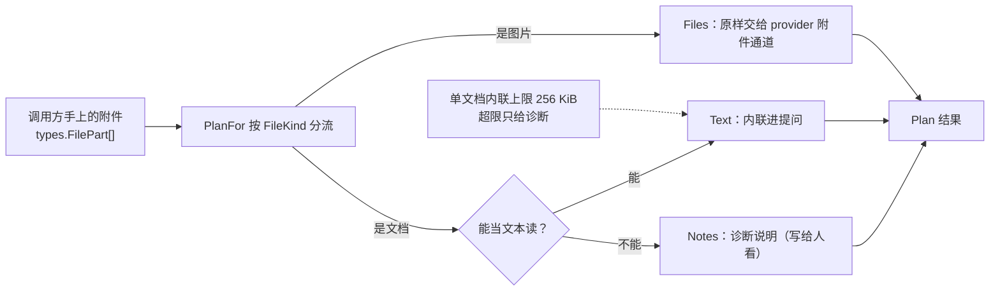

# seelebridge/attachment

## 生态位

`seelebridge/attachment` 把「手上已有的附件」变成「provider 端点真的能收的载体」：
图片原样走附件通道，文档按端点实际能力降级为内联文本或诊断说明。

主要调用方：`seelebridge` 根包的输入装配路径与真机冒烟测试。

## 职责与非职责

- 做：按 `FileKind` 分流（`PlanFor`）；文档能否当文本读的判定与内联；逐条处置说明（`Notes`）。
- 不做：不落盘、不做配额管理（归 `sessionstore` 媒体分区）、不决定 UI 展示。

## 为什么文档必须降级

真机实测（`api.deepseek.com` / `deepseek-v4-flash`）的结论：

| 通道 | 结果 |
|---|---|
| 图片 `image_url` | 通（模型能答出图里的颜色） |
| OpenAI 官方嵌套形状 `{"type":"file","file":{...}}` | 400：端点读的是**扁平**字段 |
| 扁平 `{"type":"file","file_data":…,"filename":…}` | 只认 webp/png/jpeg/gif，PDF/text 一律 400 |
| `/files` 上传（`purpose=user_data`） | 同样只收图片，PDF 400 |
| Anthropic 兼容端点的 document block | 200 但内容不进模型（回答为空） |

所以**文档通道在这个端点上不存在**。硬塞的正确做法是降级：能当文本读的内联成文本
（同问法真机验证过，模型能原样答出附件里的编号），不能读的给诊断——绝不静默丢弃。

## 数据流图



`Text` 由调用方拼进提问；`Notes` 只用于日志与界面，不发给模型。

## 并发、存储与错误语义

- 无共享状态、无锁；纯函数式分流。
- 单个文档内联上限 `Limit = 256 KiB`：内联既吃上下文也吃 token，超限降级为诊断。
- 读取失败不静默丢弃，一律产出 `Notes` 条目。

## 扩展方式

端点新增文档通道时，改 `inlineDocument` 的分流判据即可；新增附件类型时在
`PlanFor` 增加分支，并同步本 README 的判定表。

## Review 指南

- 是否出现「静默丢弃附件」的路径（必须至少产出 `Notes`）。
- 内联文本是否可能无界增长（必须受 `Limit` 约束）。
- 是否把原生不支持的形状直接塞给端点（会 400 整次请求）。

## 测试与验证

```text
go test ./seelebridge/attachment -count=1
go test ./seelebridge/... -count=1
```
