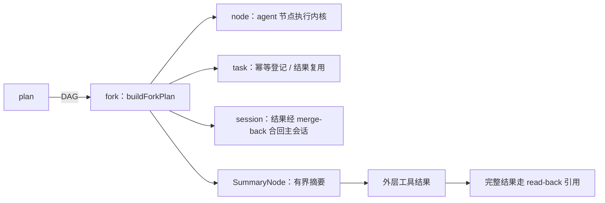
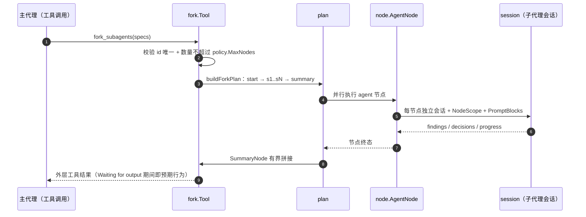

# Fork

## 生态位

`seelebridge/fork` 承载 `fork_subagents` 的纯类型与 DAG 构造：

- `types.go`：`Input`/`SubagentSpec` 输入契约、`SubagentsContractDescription`
  工具契约描述、`PlanCanonical` 规范 JSON（审计/展示）。
- `summary.go`：`SummaryNode` 汇总节点（把前驱输出压缩为每子代理一行的
  有界摘要，rune 计数截断）与 `ResultSummaryLines`/`SummaryLineLimit`/
  `SummaryMaxLines` 截断参数。

执行编排（账号/任务绑定/结果复用/worktree 生命周期）在本包 `tool.go`
（`Tool`/`NewTool`/`buildForkPlan`），根包 `runtime_plan.go` 只保留
`forkSubagentsHandler` 门面转发；本包不反向依赖 `seelebridge` 根包，仅依赖
`plan` 子包（`SeelexNodeInput`）。

## 与其它域的关系



fork 把并发子代理编排成 plan DAG；节点类型是 node；结果经 session 合回
主会话；task 注册表负责幂等与并发配额。

## 时序图



## 批次失败策略（best-effort）

fork 批次的节点彼此独立（各自 worktree、各自账号、各自 goal），因此
`plan.newPlanRunner` 显式把 fork 批次的失败策略设为 `forkexec.PolicyBestEffort`
（框架默认是 fail-fast）：

- 任一节点失败**不再** cancel 整批上下文——同批兄弟节点跑完，产出照常回到父代理；
- 失败仍必须可见：`planRunResultJSON` 按节点终态派生结果状态——有 failed 节点时
  `status:"failed"` + `error` 点名失败节点（REQ-006：任一分支失败不得报整体
  completed），`nodes[].status` 逐行可见；
- 只有**整批 agent 节点无一幸存**时才回到工具错误（错误会顶掉工具结果内容，
  有幸存产出时不能再走错误通道）。

背景（2026-09-29 事故）：`fix-return-to-latest` 的流在 22:02:33 起满 300s 被
整请求超时掐断（failed），旧 fail-fast 立刻 cancel 整批，`fix-coldload-interference`
在 0.346s 后被连坐取消并报出没有来由的 `context canceled`，已完成产出一起被丢。
同一策略已在 `node/agent_node.go` 的 worktree 收尾降级（2026-09-11 事故）有过先例。

## 验证

```text
go test ./seelebridge -count=1
```
