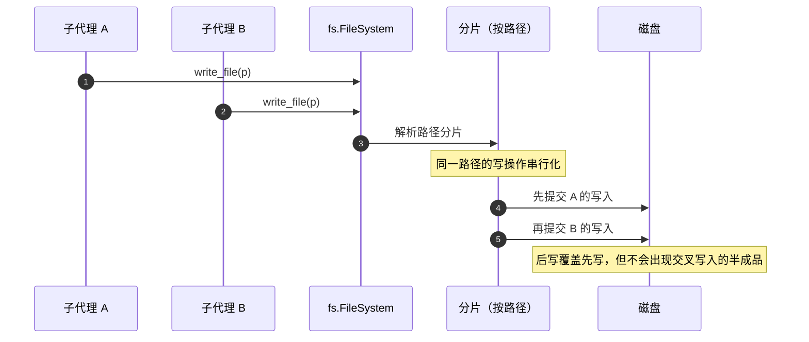
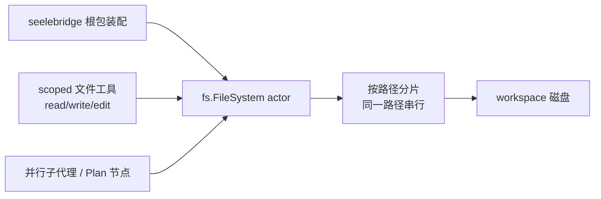

# FS

## 生态位

`seelebridge/fs` 提供文件系统 actor：`FileSystem` 按路径分片串行化写操作，
避免并行子代理互相覆盖 `write_file`/`edit_file`（P0 修复，2026-08）。

被 `seelebridge` 根包装配消费；不反向依赖根包。

## 时序图



## 架构图



## 验证

```text
go test ./seelebridge/fs -count=1
```
