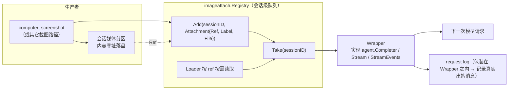
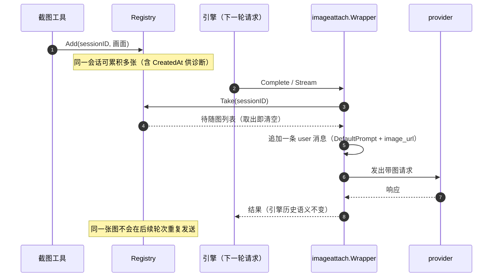

# seelebridge/imageattach

## 生态位

`seelebridge/imageattach` 把「会话里刚看到的画面」送到模型眼前，落在
**引擎与 provider 之间最窄的那条缝**上：`Completer` / `StreamCompleter`。

为什么在这层：引擎按自己的历史构造消息，它并不知道 Seelex 的会话媒体分区里
什么时候多了一张图；在这里补一条带图的 user 消息，模型就能看到画面，同时不改动
引擎的历史语义。

主要调用方：`seelebridge/runtime_image.go`（截图落盘后 Add）与根包请求装配（Take）。

## 职责与非职责

- 做：会话级待随图队列（`Registry`）；发请求前把队列挂上（`Wrapper`）；`Take` 即清空。
- 不做：不截图、不落盘、不管媒体配额与回收（归 `sessionstore` 媒体分区与
  `CollectMedia`）。

## 语义：至多送一次

工具侧 `Add`，请求侧 `Take`：取出即清空，所以同一张图不会在后续每一轮重复占用
token 与配额。包装位置刻意在 request log **之内**，因此请求日志记录的就是真正
发出去的消息。

## 架构图



## 时序图



## 并发、存储与错误语义

- `Registry` 自持 `sync.Mutex`；`pending` 按会话 ID 分桶，不同会话互不干扰。
- `Attachment.Ref` 非空而 `File` 为空时按需 `Loader` 加载；ref 读不到且没有本体时
  触发 `OnDrop` 回调，不静默吞掉。
- `Stream` / `StreamEvents` 未装配时，流式调用退化为「一次同步 Complete + 单块回调」，
  与引擎在没有 `StreamCompleter` 时的回退语义一致。
- `DefaultPrompt` 明确说出「这是刚刚截取的屏幕画面」，否则模型容易把图片当成历史装饰。

## 扩展方式

新增随图来源：产出 `Attachment` 并 `Add`，无需改 `Wrapper`。新增图片载入位置：
替换 `Options.Loader`。需要改变提示语时用 `Options.Prompt`，不要改 `DefaultPrompt` 常量。

## Review 指南

- 是否出现「同一张图被重复发送」（`Take` 是否仍在请求侧调用）。
- 归属是否按**执行会话**解析（并行执行期间视图可能已切走，用视图会话会把画面写进另一个项目）。
- `OnDrop` 是否被忽略（会导致静默丢图，真机冒烟用「提示词里不存在的颜色词」断言图片确实送达）。

## 测试与验证

```text
go test ./seelebridge/imageattach -count=1
go test ./seelebridge/... -count=1
```
