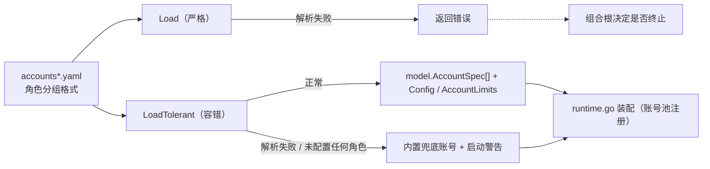

# Config

## 生态位

`seelebridge/internal/config` 承载简化账号 YAML（accounts*.yaml 角色分组格式）
的加载：产出账号规格（`model.AccountSpec`）与 Seelex 侧上下文/输出预算
（`Config`/`AccountLimits`）。属于根 facade 的装配细节（仅 runtime.go 使用），
置于 internal/；根包直接 import 使用（`runtime_account.go` 的
`currentAccountLimits` 委托 account.Manager），不再有重导出层。

## 容错加载

`Load` 保持严格：YAML 解析失败或未配置任何角色时返回错误。`LoadTolerant`
在同一失败场景下返回内置兜底账号配置，并把原始错误作为非致命启动警告交还
调用方——配置写错时应用照常启动，错误原因由 GUI/TUI 展示，而不是启动即退出。
配置文件缺失仍视为正常回退（无警告）。

## 数据流图



## 账号并发租约

账号条目可选 `max_concurrency`（必须 > 0），按角色有默认值：`agent` 与
`goalplan` 为 1（主会话/规划路径受 Session 单锁约束，租约仅作兜底）；
`subagent` 为高水位 1024——subagent 只是“角色 + 模型供应商”，框架不再设
实用并发上限（2026-09-07），实际在途请求由供应商/API 限流与 429 重试
约束。显式 `max_concurrency` 覆盖角色默认值；零值在 Load 时返回错误
（上游 accountpool Register 要求正数）。

## 验证

```text
go test ./seelebridge -count=1
```
