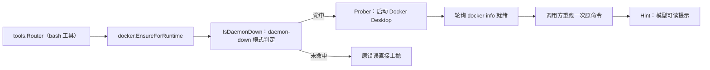

# internal/docker 域

## 生态位

承载 Docker 守护进程自动恢复（2026-08-07 根治）：bash 工具失败且错误匹配
daemon-down 模式 → 自动启动 Docker Desktop → 轮询就绪 → 调用方重跑一次
命令。主要调用方：`tools.Router`（经 Deps 闭包）。

## 职责与非职责

- 职责：`IsDaemonDown` 模式判定、`CLIPath` 定位、`Prober` 探测/启动、
  `EnsureDaemon`/`EnsureForRuntime` 恢复编排、`Hint` 模型可读提示。
- 非职责：容器编排/镜像管理等 docker 业务能力。

## 与其它域的关系

只做「恢复守护进程」这一件事：容器编排、镜像管理等 docker 业务能力不在此域。

## 核心实现

- `RealProber`：`docker info` 快速探测 + Windows 启动路径（CLI 优先，
  回退 Docker Desktop.exe）。
- `EnsureForRuntime`：按 limits 的 disable/start-timeout 配置执行恢复。

## 数据流

bash 失败 → Router 判定 daemon-down → EnsureForRuntime → Start → 轮询 Up →
重跑一次命令；仍失败附加 Hint。

## 依赖方向

允许依赖：`security`（FileExists/ConfigureHiddenCommand）。禁止依赖：
seelebridge 根包及其它域。

## 并发、存储、安全

无共享状态（测试可覆盖 CLILookup/fixedPaths 注入缝）；命令隐藏窗口防弹窗。

## 扩展方式

新增平台启动路径：扩展 `RealProber.Start`；新增判定模式：
`daemonDownMarkers`。

## Review 指南

- daemon-down 误判是否会导致无关失败被自动恢复；非 Windows 是否显式报错。

## 测试与验证

`go test ./seelebridge/internal/docker/...`（纯函数测试随域迁移）。
