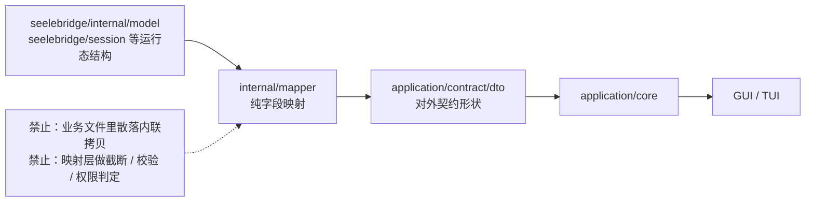

# seelebridge/internal/mapper

## 生态位

`seelebridge/internal/mapper` 是 seelebridge 内部的**无业务转换**层：集中
运行态结构（`seelebridge/internal/model`、`seelebridge/session` 等）与对外
契约（`application/contract/dto`）之间的形状映射，禁止在业务文件中散落
内联拷贝。

## 职责与非职责

- 职责：纯字段映射（如 `Duration` → `DurationMS`）、类型投影。
- 非职责：不做截断、校验、权限、策略或状态迁移；这些留在调用方业务代码。

## 数据流图

## 目录结构

- `mapper.go`：转换函数（`ToolEventToDTO` 等）。
- `README.md`：本说明。

## 核心实现

- `ToolEventToDTO(subagentsession.SubagentToolEvent) dto.SubagentTool`：
  运行态工具事件 → 实时流对外 DTO。

## 依赖方向

- 允许依赖：`application/contract/dto`、`seelebridge/internal/model`、
  `seelebridge/session` 等 seelebridge 域包。
- 禁止反向依赖：任何域包不得依赖本包内的实现细节（转换只经公开函数调用）。

## 扩展方式

新增跨层转换时先判断是否已有同形状类型（优先 alias 单源）；确需转换的
映射集中到本包，并保持纯函数、无副作用。

## Review 指南

- 转换是否只做形状映射？是否夹带业务逻辑（截断/校验）？
- 目标字段是否与 dto 契约同步（字段增删时转换点 = 1）？

## 测试与验证

转换函数无独立测试文件，由调用方（`runtime_live.go` 实时流）集成覆盖；
修改后运行 `go test ./seelebridge/... -count=1`。
