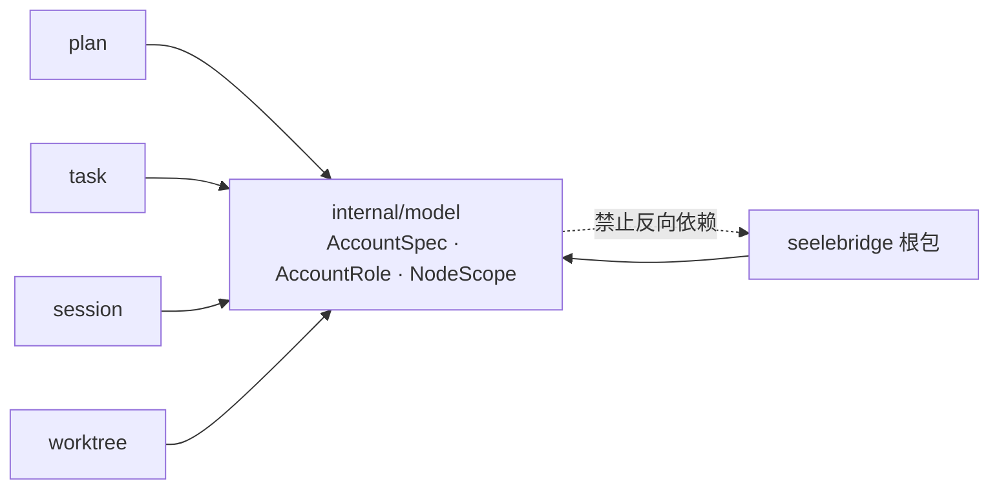

# Model

## 生态位

`seelebridge/internal/model` 承载 seelebridge 各域共享的纯类型（无运行时依赖），
供根包 facade 与 plan/worktree/task/session 等子包共同引用，避免跨包类型环。

## 依赖方向

它只放「多域都要用、且不依赖任何运行时」的形状；一旦某个类型只被单一域使用，
就应留在该域内，不进这里。
