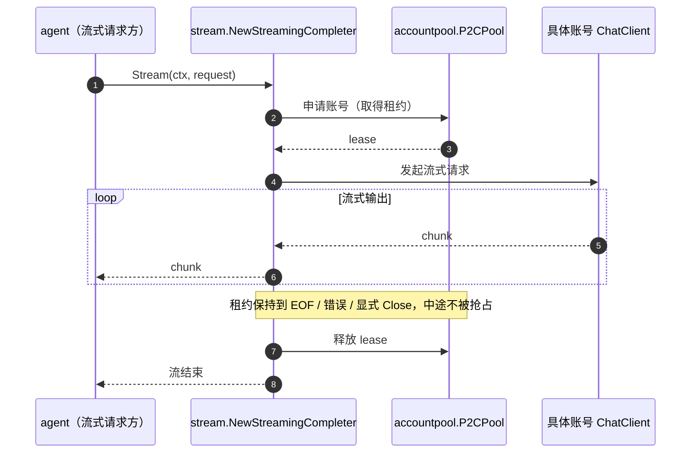

# Stream

## 生态位

`seelebridge/internal/stream` 承载流式账号 Completer 适配器
（`NewStreamingCompleter`）：把账号池的同步 Completer 适配为流式
`agent.StreamCompleter`，租约覆盖整条流直到 EOF/错误/Close 才释放。
属于根 facade 的装配细节（仅 runtime.go 装配使用），置于 internal/；
单元测试随包（`stream_test.go`），runtime 装配集成测试保留在根包
（`stream_integration_test.go`）。

## 时序图



## 验证

```text
go test ./seelebridge/internal/stream -count=1
```
