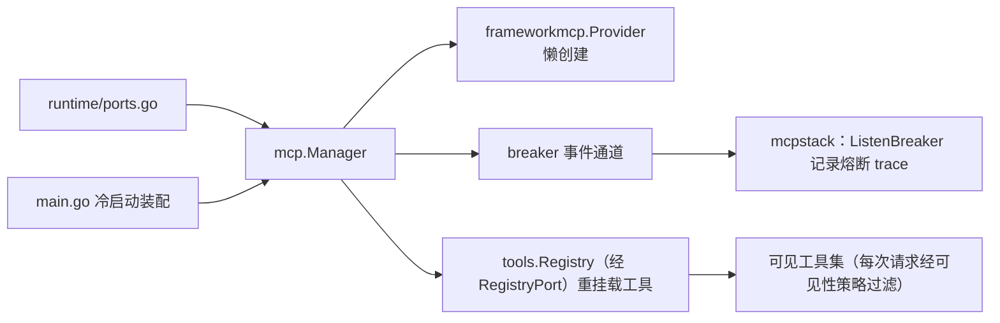
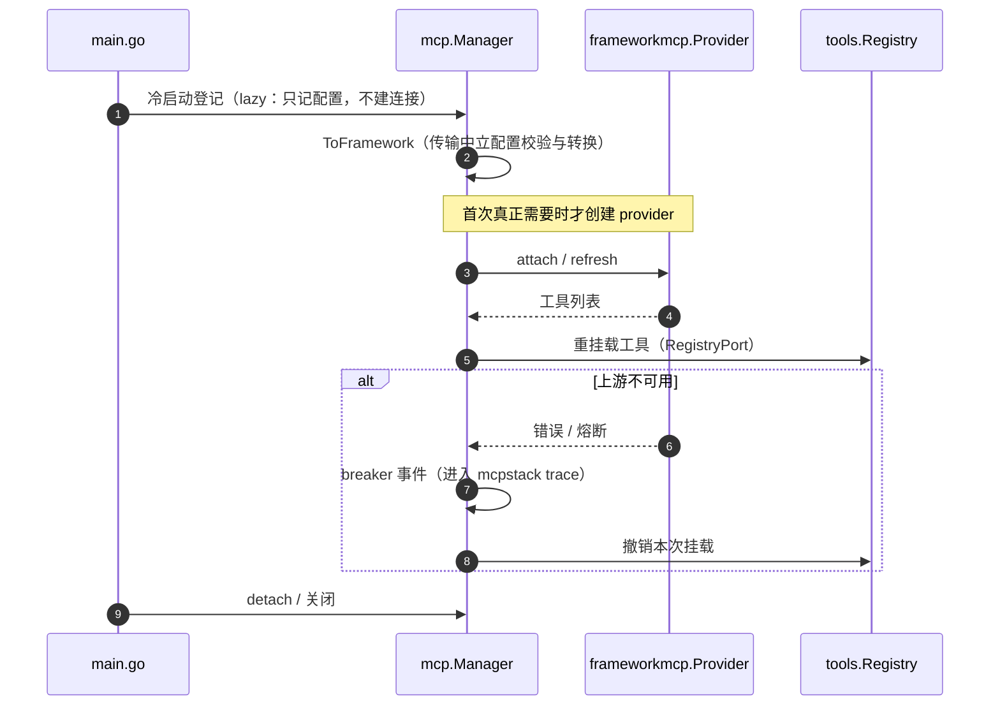

# mcp 域

## 生态位

承载 Seelex 的 MCP 服务器生命周期：provider 懒创建、breaker 事件通道、
lazy 冷启动登记、attach/detach/refresh、工具重挂载。主要调用方：
`ports.go`（Runtime MCP 端口）、`main.go`（冷启动装配）。

## 职责与非职责

- 职责：`Manager` 持有 MCP 生命周期状态并对外提供服务；`ToFramework`
  做传输中立配置校验与转换。
- 非职责：MCP 调用 trace 的数据层（归 `mcpstack`）、插件驱动的 MCP 装配
  （归顶层 `plugin/`）。

## 与其它域的关系

## 时序图

## 核心实现

- `Manager.Provider()`：provider 懒创建（首次使用才实例化）。
- `RegisterLazy`/`Load`：冷启动登记 + 按需连接（幂等，失败不破坏登记）。
- `refreshTools`：把 MCP provider 重挂载到工具注册表（Unregister+Register）。

## 数据流

Attach → breaker 通道初始化 → `mcpstack.ListenBreaker(stack, ch)` →
provider.Attach → 工具重挂载 → 注册表可见。

## 依赖方向

允许依赖：`frameworkmcp`、`mcpstack`、`framework tools`、`types`。
禁止依赖：seelebridge 根包及其它域（registry 经接口注入）。

## 并发、存储、安全

`Manager` 自带锁（lazyMu）；breaker channel 有界（64）；配置校验在
`ToFramework` 内（name/transport/command 契约）。

## 扩展方式

新增 transport：扩展 `ToFramework` 校验与 `frameworkmcp.ServerConfig` 映射。

## Review 指南

- 重挂载是否幂等；detach 后工具是否从注册表移除。
- lazy 登记是否与 Attach 校验一致（防配置绕过）。

## 测试与验证

`go test ./seelebridge/... -run 'MCP|Breaker'`；根包
`mcp_provider_test.go`/`mcp_integration_test.go` 覆盖。
