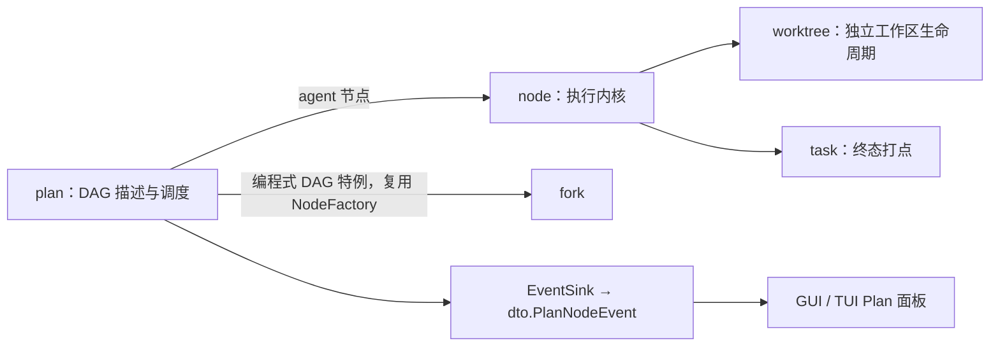
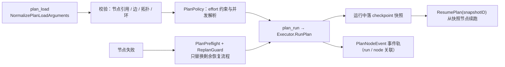

# Plan

## 生态位

`seelebridge/plan` 承载 Plan 执行域（依赖方向：根 facade → plan；plan 不反向
依赖 seelebridge 根包，共享账号类型经 `internal/model`，节点负载类型本包导出）：

- `graph.go`：`PlanEdge` / `AdjacencyToEdges` / `DetectCycle` / `TopoSort`。
- `policy.go`：`PlanPolicy`（effort 约束、节点预算上限校验、并发解析）。
- `executor.go`：`Executor` 执行域组件（策略/绑定/runID/事件通道/replan/
  审批门/子代理工厂；deps 闭包注入 Runtime 能力，含 `CurrentRunID`/
  `EventSink`/`LoadedPlan`/`MaxForkConcurrency` 读取面）。
- `preflight.go`：`PlanPreflight`/`ReplanRequest` + 隔离规划/重规划回合。
- `tool_provider.go`：`ToolProvider`（plan_load/plan_run/plan_clear/status/
  export/validate）、`LoadedPlanDoc`、`Executor.RunPlan`/`ResumePlan`/
  `newPlanRunner`（checkpoint 接线：`SetCheckpointStore` 装配后 plan_run 落
  最终快照，`ResumePlan(snapshotID)` 经 `runner.WithCheckpoint` + `Resume`
  从快照节点续跑，事件轨 run/node 关联与 RunPlan 同一契约）。
- `events.go`：`PlanNodeEvent` 投影 + `EventSink`（事件库 + 订阅 + 持久化钩子）。
- `replan_guard.go`：`ReplanGuard` 进程级重规划护栏与 `ReplanMetrics`。
- `input_adapter.go`：`NormalizePlanLoadArguments` 规范化/兼容归一化。
- `factory_types.go`：`SeelexNodeInput`/`NodeBudgetInput` 节点负载、
  `CanonicalPlanDocument`、product/approval 节点实现。
- `branch_types.go`：`PlanBranchBinding`/`PlanBranchEvent` 分支绑定类型。
- `authority.go`：`AuthorizePlanMutation` 变更授权钩子（当前放行）。

根包 `runtime_plan.go` 保留 plan 门面
（`PrepareReplan`/`currentPlanPolicy`/`SetPlanPolicy`/...）+ 节点工厂
`nodeFactory`/`nodeFactoryDeps`（`SeelexAgentNode` 依赖 Runtime 节点作用域
服务）；不再有根包重导出层。

## 与其它域的关系



plan 是 DAG 描述与调度；agent 节点委托 node 执行；fork 是 plan 的编程式
特例；事件经 EventSink 投影为 dto.PlanNodeEvent 供前端消费。

## 数据流图



## 批次失败策略（best-effort）

`newPlanRunner` 显式 `SetForkPolicy(forkexec.PolicyBestEffort)`：plan/fork 批次里的
节点彼此独立（独立 worktree、独立账号、独立 goal），单点失败不该让整批归零，
也不该连坐取消已经跑出结果的兄弟节点。框架 `ForkCoordinator` 的默认值是
fail-fast（`forkexec.go` 的 `policy()`），不显式设置就会连坐。

配套的结果契约在 `planRunResultJSON`：best-effort 下框架不再回错误，因此整体状态
改由节点终态派生——有 failed 节点 → `status:"failed"` + `error` 点名失败节点及其
原因（REQ-006：任一分支失败不得报整体 completed，`application/core` 的
`planRunFailure`/`updatePlanFromRunResult` 都吃这个字段）；有幸存节点时不回错误
（错误会顶掉工具结果内容，幸存产出就传不回父代理）；整批 agent 节点无一幸存时
仍回工具错误。

## 验证

```text
go test ./seelebridge/plan -count=1
```
