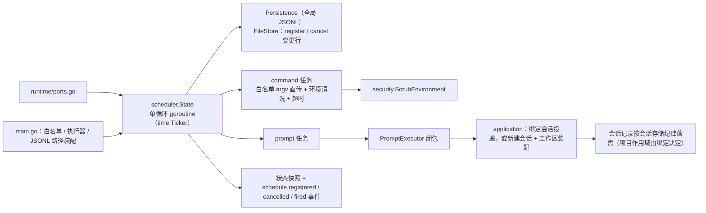
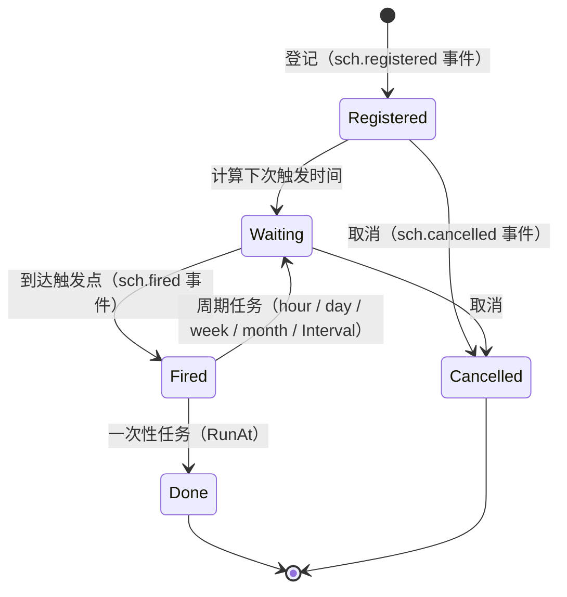

# scheduler 域

## 生态位

承载 seelex 的定时/周期任务 actor：标准库 time.Ticker 驱动单循环 goroutine，
任务两类（command 白名单命令 / prompt 复用 agent 会话），排期两种：
周期重复（minute/hour/day/week/month 或固定 Interval）与一次性定时（RunAt）。

任务**定义**落在一个**全局** JSONL 里（默认 `<store>/scheduled-tasks.jsonl`，
见 `persistence.go`）：一行一条变更、append-only、不按项目分区也不按会话分片。
触发产生的**会话记录**不在这里——那走会话自己的存储与读写纪律。

主要调用方：
`ports.go`（调度器端口）、`main.go`（白名单、执行器与 `ScheduledTasksPath` 装配、
冷启动 `RestoreScheduledTasks`）。

## 职责与非职责

- 职责：任务登记/校验/编辑/排期/取消/快照、任务定义的全局 JSONL 持久化与冷启动
  重建、白名单命令执行（argv 直传、环境清洗、超时）、prompt 任务委托执行器。
- 非职责：会话执行本身（归 session/agent）、命令的 shell 语义、**触发产生的
  会话正文**的落盘（归 sessionstore；本域只给执行器"新建会话 + 装配工作区"
  这条指令，不碰任何存储实现）、按项目/会话分区的任务副本（任务定义只有全局
  一份）。

## 与其它域的关系



## 排期状态



`month` 是日历月：月末日期自动钳制（如 1-31 加 1 月 → 2-28/29）。

### 周期锚点（开始时间 / 星期几）

周期有两个口径，由 `ScheduledTaskSpec.StartClock` / `StartWeekday` 决定：

| 口径 | 触发时刻 | 例（2026-10-07 星期三 10:00 创建） |
|---|---|---|
| **锚点**（给了 `HH:MM`） | 严格晚于 now 的第一个锚点墙钟 | 每天 09:00 → 10-08 09:00；每周一 09:00 → 10-12 09:00 |
| **滚动**（没给锚点） | `now + 周期`，即"每个周期按当前时间" | 每 1 天 → 明天 10:00 |

锚点只对有"几点"可言的单位（day / week / month）开放；minute / hour 是子日周期，
给了就报错（不静默忽略——静默吞掉锚点会让「每天 09:00」悄悄退化成「创建时刻起每 24 小时」）。
星期用 ISO（1 = 周一 … 7 = 周日），只归周周期、且必须与 `HH:MM` 同时给。
`9:00` 这类短写接受并归一成 `09:00`。锚点的墙钟含义由
`nextScheduledAt` → `advanceToAnchor` / `anchorOnDay` / `isoWeekday` 实现。

### 触发落点（会话与工作区）

prompt 任务的落点只有一条判据（`PromptExecutor` 契约，实现在装配根）：

| `ScheduledTaskSpec` | 落点 |
|---|---|
| `SessionID` 为空（**默认**） | **新建一个会话**发起；`WorkspaceID` 非空时先把新会话装配到该工作区（项目绑定 + 按会话工具根） |
| `SessionID` 非空 | 投递到那个既有会话（显式绑定） |

每次触发把实际落点写进状态的 `LastSessionID`，面板与冒烟据此指认"跑到哪个会话去了"。
新建会话在**后台**跑，不切用户正在看的视图指针；它自己的会话记录照常按会话存储纪律落盘。

## 核心实现

- `State`：自带锁的 actor；ticker 循环 `tick` 找出到期任务，独立 goroutine
  执行（running 标志防重叠），状态快照只读外发。
- `Schedule`：校验周期下限/周期单位（`period_unit`）+ 数值/锚点（`start_clock` /
  `start_weekday`，搭配非法即拒）/命令白名单/prompt 执行器装配后创建任务；周期表达支持
  minute/hour/day/week/month，month 为日历月（`addCalendarMonths` 月末钳制），无单位时回退
  `Interval` 秒级固定周期；`RunAt` 非零时创建一次性定时任务（要求晚于当前时间，创建即启用，
  执行后自动停用并清除下次排期，记录保留供面板查看）。
- `Update`：**整体替换**既有任务的定义（PUT 语义：面板上是什么，任务就是什么），
  ID 不变、运行账目保留（`RunCount` / 上次结果 / 上次落点），下次运行按新定义重算。
  校验与创建**共用** `normalizeSpec` 这一份判据——不存在"创建时拦得住、编辑时漏得过"。
- `normalizeSpec` / `applyDefinition`：前者是"什么算一个合法任务定义"的唯一实现
  （trim + 锚点归一 + 周期搭配 + 最小周期 + 白名单/执行器 + 一次性语义），后者把归一
  结果写进任务本体与状态快照（创建、编辑、冷启动重建三处共用，避免"编辑后某几格还是旧值"）。
- `Persistence` / `FileStore`：任务定义的**全局 JSONL**。一行一条变更
  （`ScheduledTaskRecord`：`deleted` 区分登记与取消墓碑），以 `O_APPEND` 追加
  一整行；`Load` 按 ID 后写覆盖先写重放，丢弃墓碑、读不动的行与未收尾的残尾。
  只存**定义与启用状态**，不存上次结果/日志尾部（那是运行期展示面，命令输出
  可能含敏感内容，不该因为"重启后想看见上次结果"而落盘）。
- `Restore`：冷启动重建。周期任务重算下次运行时间（**不追补**停机期间错过的
  触发点）；停用的恢复为停用；一次性任务时刻已过则不恢复；命令不在白名单、
  周期非法、执行器未装配等逐条跳过（返回 恢复数/跳过数），一条坏记录不挡住其余。

## 数据流

装配根启动时 Restore（全局 JSONL → 内存排期）→ Schedule/`Update`/`CancelTask`
（内存变更 + 追加一行到全局 JSONL，写失败即认定该次变更不成立）→ start
（惰启动 ticker）→ tick → executeTask（周期任务下次运行按 `nextScheduledAt`
计算；一次性任务执行后停用）→ 状态回写 + observe（通知 application 投影）。

## 依赖方向

允许依赖：`dto`、`security`。禁止依赖：seelebridge 根包及其它域、sessionstore。

## 并发、存储、安全

单循环 goroutine + 每任务独立执行 goroutine；环境变量经
`security.ScrubEnvironment` 清洗；白名单命令 argv 固定直传不经 shell。

JSONL 是 append-only 单写者通道（`FileStore.mu` 串行化）：崩溃只会留下未收尾的
残尾，读侧按"未提交"跳过；登记/取消在写失败时**不改内存**（登记失败 = 没登记，
取消失败 = 没取消），避免"面板与磁盘劈叉"。

## 扩展方式

新增任务类型：扩展 `Schedule` 校验与 `executeTask` 分支。
换持久化介质：实现 `Persistence` 并改装配根注入的实现（调度器只认端口）。
新增落点语义：改 `PromptExecutor` 契约并在装配根实现，不在调度器里按任务名分支。
可编辑字段的扩展：加进 `normalizeSpec` 与 `applyDefinition`（判据与状态投影各一处），
不要在 `Update` 里另开一段赋值。

## Review 指南

- 同一任务是否可能重叠执行；停机是否等待运行中任务（`schedulerShutdownWait`）。
- 任务定义是否仍然是**全局一份**：任何"按项目/会话分文件或分片"的改动都越界。
- 恢复路径与运行期是否共用同一套判据（周期校验、锚点、一次性过期），有没有
  出现第二份"什么算合法"的实现。
- 编辑是否只走 `normalizeSpec` + `applyDefinition`：绕开它们半路赋值，就会出现
  "状态快照和定义不一致"（面板显示旧值、排期按新值跑）。
- 触发落点是否只有一条判据（sessionID 空 = 新建会话）；新建会话有没有顺手改掉
  用户当前视图或全局工程根。

## 测试与验证

```text
go test ./seelebridge/scheduler/... -count=1
```

- `scheduler_test.go`：排期/锚点/白名单/重叠执行/执行器落点参数/编辑（整体替换、
  与创建共用校验、ID 不变、账目保留）。
- `persistence_test.go`：全局单文件、冷启动重建、取消墓碑、逐条跳过判据、
  编辑追加同 ID 定义行后的恢复、残尾丢弃。

## 文件与函数索引

- `scheduler.go`
  - `type State struct`：定时任务的 actor 资源（自带锁，读写即消息进出；存储经 `Persistence` 注入）。
  - `func NewState() *State`：构造调度器状态（base ctx 用于停机时取消运行中任务）。
  - `func NewStateWithStore(store Persistence) *State`：构造带全局 JSONL 任务定义的调度器状态。
  - `func (s *State) Start()`：惰启动 ticker 循环（首次创建任务时调用；重复调用幂等）。
  - `func (s *State) Schedule(ctx context.Context, spec ScheduledTaskSpec) (*ScheduledTaskStatus, error)`：校验入参并创建任务（创建后立即排期；observer 通知投影）。
  - `func (s *State) Update(ctx context.Context, id string, spec ScheduledTaskSpec) (*ScheduledTaskStatus, error)`：用一份新定义覆盖既有任务（ID 不变、运行账目保留、下次运行重算）。
  - `func (s *State) normalizeSpec(spec ScheduledTaskSpec) (normalizedSpec, error)`：校验并归一创建/编辑入参，是"什么算一个合法任务定义"的唯一一份实现。
  - `func (t *task) applyDefinition(definition normalizedSpec, nextRun time.Time)`：把归一后的定义写进任务本体与状态快照（创建、编辑、冷启动重建共用）。
  - `func (s *State) CancelTask(id string) error`：取消并移除任务（运行中的执行不受影响，写墓碑行）。
  - `func (s *State) Restore() (int, int, error)`：从全局 JSONL 读回任务定义（冷启动重建），返回（恢复数, 跳过数）。
  - `func (s *State) Snapshot() []ScheduledTaskStatus`：返回任务只读快照（按 ID 排序）。
  - `func (s *State) SetPromptExecutor(executor PromptExecutor)`：注入提示词任务执行器（nil = 禁用 prompt 任务）。
  - `func (s *State) SetObserver(observer func())`：注入状态变化通知（main 接 application 快照投影发布）。
  - `func (s *State) Stop()`：优雅停机：停 ticker、取消 base ctx（终止运行中任务），等待运行 goroutine 退出。
- `persistence.go`
  - `type ScheduledTaskRecord struct`：JSONL 里的一行：一条任务定义的一次变更。
  - `type Persistence interface`：任务定义的全局持久化端口（Append 追加变更，Load 返回重放后的当前任务集）。
  - `type FileStore struct`：Persistence 的全局 JSONL 实现（一个路径、一行 JSON、一个换行）。
  - `func NewFileStore(path string) *FileStore`：构造全局 JSONL 任务定义存储。
  - `func (store *FileStore) Path() string`：返回落盘路径（空 = 未配置，调度器此时不持久化）。
  - `func (store *FileStore) Append(record ScheduledTaskRecord) error`：追加一行变更（O_APPEND 写一整行，失败即本次变更不成立）。
  - `func (store *FileStore) Load() ([]ScheduledTaskRecord, error)`：读回当前任务集（丢弃墓碑、读不动的行与未收尾残尾）。
