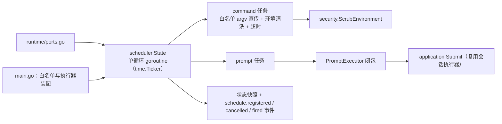
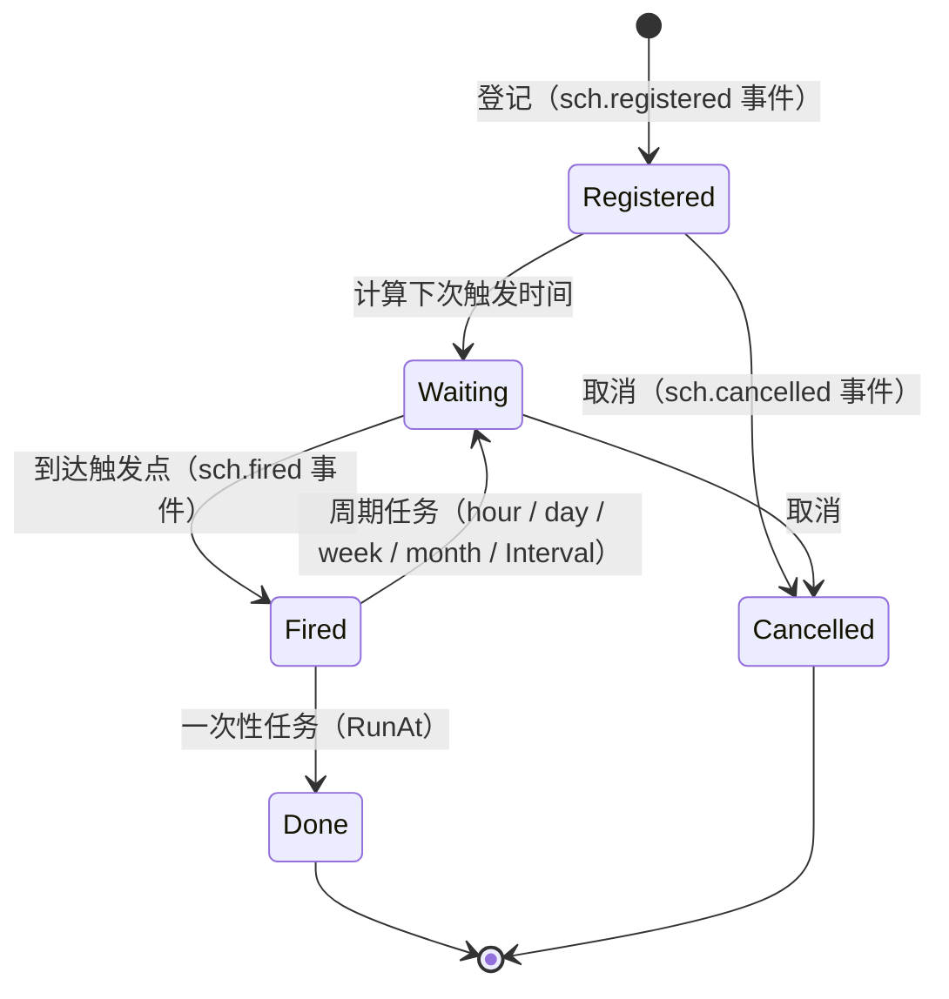

# scheduler 域

## 生态位

承载 seelex 的定时/周期任务 actor：标准库 time.Ticker 驱动单循环 goroutine，
任务两类（command 白名单命令 / prompt 复用 agent 会话），排期两种：
周期重复（minute/hour/day/week/month 或固定 Interval）与一次性定时（RunAt）。
主要调用方：
`ports.go`（调度器端口）、`main.go`（白名单与执行器装配）。

## 职责与非职责

- 职责：任务登记/校验/排期/取消/快照、白名单命令执行（argv 直传、环境
  清洗、超时）、prompt 任务委托执行器。
- 非职责：会话执行本身（归 session/agent）、命令的 shell 语义。

## 与其它域的关系

## 排期状态

`month` 是日历月：月末日期自动钳制（如 1-31 加 1 月 → 2-28/29）。

### 周期锚点（开始时间 / 星期几）

周期有两个口径，由 `ScheduledTaskSpec.StartClock` / `StartWeekday` 决定：

| 口径 | 触发时刻 | 例（2026-10-07 星期三 10:00 创建） |
|---|---|---|
| **锚点**（给了 `HH:MM`） | 严格晚于 now 的第一个锚点墙钟 | 每天 09:00 → 10-08 09:00；每周一 09:00 → 10-12 09:00 |
| **滚动**（没给锚点） | `now + 周期`，即"每个周期按当前时间" | 每 1 天 → 明天 10:00 |

锚点只对有"几点"可言的单位（day / week / month）开放；minute / hour 是子日周期，
给了就报错（不静默忽略——静默吞掉锚点会让「每天 09:00」悄悄退化成「创建时刻起每 24 小时」）。
星期用 ISO（1 = 周一 … 7 = 周日），只归周周期、且必须与 `HH:MM` 同时给。
`9:00` 这类短写接受并归一成 `09:00`。锚点的墙钟含义由
`nextScheduledAt` → `advanceToAnchor` / `anchorOnDay` / `isoWeekday` 实现。

## 核心实现

- `State`：自带锁的 actor；ticker 循环 `tick` 找出到期任务，独立 goroutine
  执行（running 标志防重叠），状态快照只读外发。
- `Schedule`：校验周期下限/周期单位（`period_unit`）+ 数值/锚点（`start_clock` /
  `start_weekday`，搭配非法即拒）/命令白名单/prompt 执行器装配后创建任务；周期表达支持
  minute/hour/day/week/month，month 为日历月（`addCalendarMonths` 月末钳制），无单位时回退
  `Interval` 秒级固定周期；`RunAt` 非零时创建一次性定时任务（要求晚于当前时间，创建即启用，
  执行后自动停用并清除下次排期，记录保留供面板查看）。

## 数据流

Schedule → start（惰启动 ticker）→ tick → executeTask（周期任务下次运行按
`nextScheduledAt` 计算；一次性任务执行后停用）→ 状态回写 + observe
（通知 application 投影）。

## 依赖方向

允许依赖：`dto`、`security`。禁止依赖：seelebridge 根包及其它域。

## 并发、存储、安全

单循环 goroutine + 每任务独立执行 goroutine；环境变量经
`security.ScrubEnvironment` 清洗；白名单命令 argv 固定直传不经 shell。

## 扩展方式

新增任务类型：扩展 `Schedule` 校验与 `executeTask` 分支。

## Review 指南

- 同一任务是否可能重叠执行；停机是否等待运行中任务（schedulerShutdownWait）。

## 测试与验证

`go test ./seelebridge/scheduler/...`（scheduler_test.go 随域迁移）。
