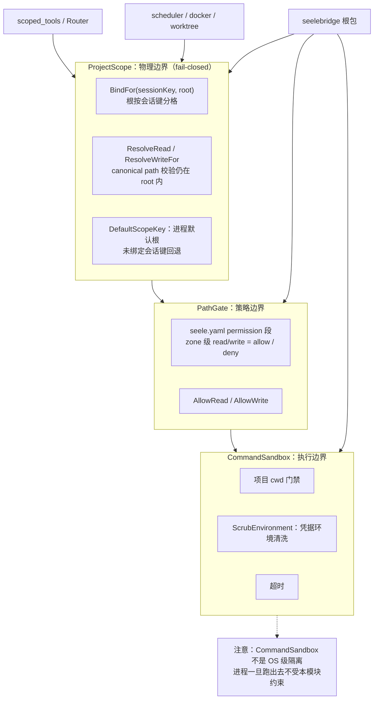

# Security

## 生态位

`seelebridge/security` 承载项目作用域、路径门禁与命令执行隔离的安全边界：

- `project_scope.go`：`ProjectScope` 项目根 containment（fail-closed，无 fallback root）。
  根按**会话键**分格：`BindFor(sessionKey, root)` / `Resolve*For(sessionKey, …)`
  让每个会话用自己的项目根（多项目并行/后台会话不借用视图会话的根）；空键
  （`DefaultScopeKey`）是进程默认根（当前视图会话），未绑定会话键回退默认根。
- `pathgate.go`：`PathGate` allow/ask/deny 权限规则（读取 `seele.yaml` permission 段）。
- `sandbox.go`：`CommandSandbox` shell 执行隔离端口（项目 cwd 门禁 + 凭据环境清洗 +
  超时，非 OS 级隔离）；`ScrubEnvironment`/`FileExists` 供根包命令路径复用。
- `command_class.go`：`ClassifyCommand(command) bool` —— `bash_read` 的**服务端只读
  判定**（纯函数 + 表驱动，无状态、无 I/O）。它回答的是"这条命令能不能走只读工具
  面"，**不是**沙箱：判定不改变 cwd 门禁与凭据清洗，也不放宽任何写路径——写命令
  只是被要求改用 `bash`（rw 簇、规则照旧），绝不静默降级成执行。
- `command_windows.go`/`command_other.go`：`ConfigureHiddenCommand`（平台构建标签）——**合并写入** `SysProcAttr` 而不是整体赋值：`internal/winhide` 也往同一处写 `CREATE_NO_WINDOW`，谁赋值谁就把对方抹掉。
- `process_tree_windows.go`/`process_tree_other.go`：`ProcessTree`（Windows = Job Object + `KILL_ON_JOB_CLOSE`；POSIX = 进程组 + `kill(-pgid)`）与 `ConfigureProcessTree`。**`taskkill /T` 不够**：MSYS2/Git Bash 的 fork 子 shell 不一定挂在直接父 PID 下，实测杀不掉；Job Object 不看父子关系，关句柄即整树回收。Job 建不出来时退化为按 PID 杀，由 `Degraded()` 如实报出（此时不得主张"整棵进程树已终止"）。

被根包 `scoped_tools` / `runtime` / `scheduler` / `docker` / `worktree_manager` 消费；
不反向依赖 `seelebridge` 根包；根包直接 import `security.*`（如
`security.CommandSandbox`），不再有重导出层。

## 架构图



两层边界必须同时成立：`ProjectScope` 决定「能不能逃出项目目录」，
`PathGate` 决定「项目内哪些操作仍需审批」，两者不能互相替代。

## 验证

```text
go test ./seelebridge/security -count=1
```
