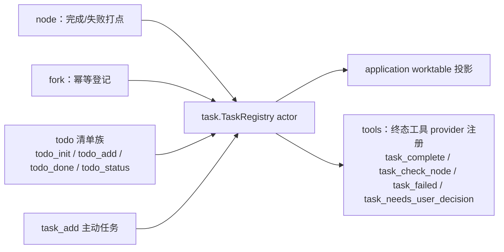
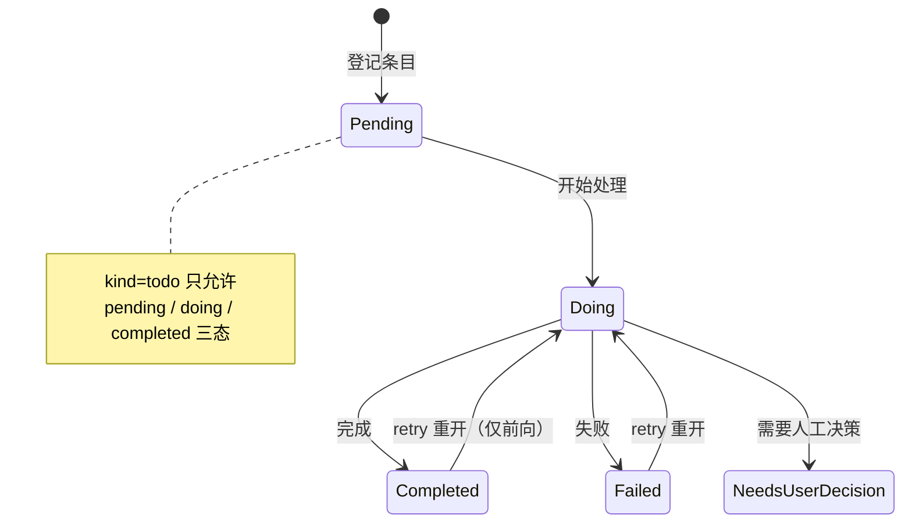

# Task

## 生态位

`seelebridge/task` 承载 worktable/task 注册表域：

- `task.go`：`TaskRegistry` actor（mailbox 单消费者串行，按 task 键隔离状态）、
  `TaskRecord`/`TaskSpec`/`TaskStatus`/`TaskTracePoint`/`TaskPhase*` 共享 DTO、
  `TodoItem` 兼容契约（`TaskToTodoItem`/`TodoToTaskStatus`）、
  `TaskKeyForGoal` 幂等键（归一化 goal 哈希）、`SetDefaultBatch` 默认批次
  （startChat 注入 requestID，新建条目自动盖章 `BatchID`）、进程级自动 ID
  分配（`NextAutoID`/`ObserveAutoID`，见下）。
- `terminal.go`：`TaskTerminalHandler` 与 `TaskTerminalProvider`
  （`task_complete`/`task_check_node`/`task_failed`/`task_needs_user_decision`
  工具定义，handler 由 application 侧注入）。
- `tools.go`：todo 清单族（`todo_init/todo_add/todo_done/todo_status` 规范名
  + `todolist_*` deprecated 兼容别名）与主动任务 `task_add`（旧 `taskadd`
  别名）的注册与 handler；todo 与 task 共用注册表，条目类型由 `Kind` 权威
  区分（todo 三态状态机，task/plan/subagent 通用迁移）。

依赖方向为根 facade → task；task 不反向依赖 `seelebridge` 根包。根包
`runtime.go` 持有 `*task.TaskRegistry`，`runtime_tools.go` 注册 todo/task 工具，
门面方法与别名重导出层已删除，门面方法委托本包实现。

## 与其它域的关系



## 状态机



task 是 worktable 状态面：node 完成/失败、fork 幂等登记均写 task；todolist
融合为 kind=todo 的 task；主动 `task_add` 直接登记 kind=task 条目；终态
工具 provider（`task_complete` 等，会话级协议）经 tools 注册表暴露给模型。
新建条目按 `defaultBatchID`（chat 请求批次）盖章，空批次（早期/恢复数据）
归入「早期任务」展示分组。

## 命名与状态机

- 工具命名体现条目类型粒度：`todo_*`（清单项）、`task_add`（主动任务）、
  `task_complete/failed/needs_user_decision`（会话级终态协议）。兼容期
  内 `todolist_*`/`taskadd` 保留为 deprecated 别名（描述标注），
  `main.go defaultManualRules` 新旧名同列。
- `validateTaskTransition(kind, current, next)`：todo 仅允许
  pending/doing/completed 三态；task/plan/subagent 维持终态→retry 重开、
  running/doing 不回退、retry 仅前向的通用迁移。

## 自动条目 ID 的分配（进程级）

无显式 ID 的条目（`task_add` 的 `task_id`、todo 清单项）由注册表出号。行 ID
是注册表的行键，也是跨会话台账的分组身份，所以它有两条硬约束：

- **进程内唯一**：自增源是包级的（`NextAutoID(prefix)`，跨注册表与跨会话
  scope 分区共享），因此两个会话各自产生无显式 ID 的条目不会同号——同号在
  注册表里是**覆盖**（`state.tasks[id]` 以 ID 为键），在台账里会被合并去重
  丢掉一行，前端 `data-work-row`/`task.changed` 也只认一行；
- **不重发已占用的号**：装载/恢复（会话切换 `ReplaceAll`、磁盘记录）会把外部
  的号带进来，`ObserveAutoID(id)` 抬高水位、`nextFreeIDLocked` 再跳过注册表里
  已占用的号。水位是**进程内**的，跨进程/跨项目的精确归档不在本层。

`TaskRegistryState` 不再持有私有计数器（历史行为是每个注册表/每个分区各自
从 1 数）。

## 验证

```text
go test ./seelebridge/task -count=1
```

`registry_test.go` 覆盖 actor 状态机与并发，`auto_id_test.go` 覆盖自动 ID 的
进程内唯一性（装载记录占用的号不得重发/覆盖）。
