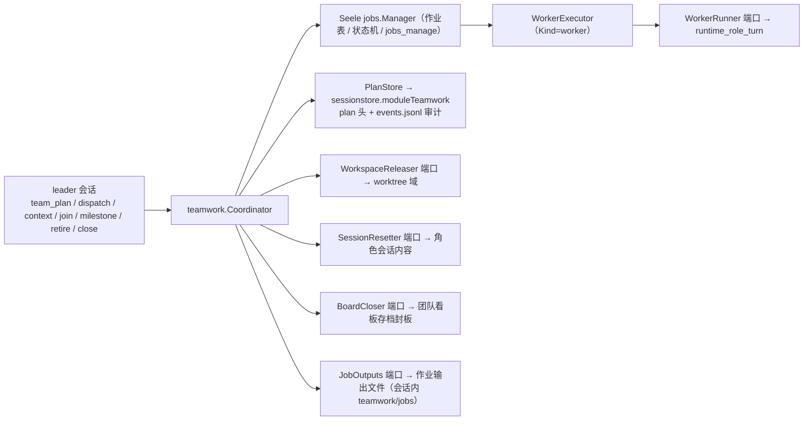
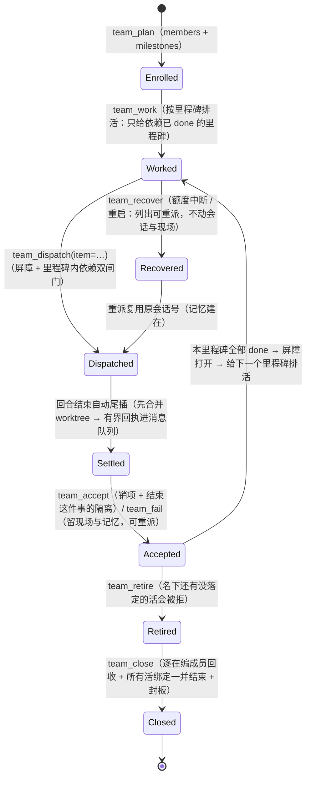

# seelebridge/teamwork — leader/worker 团队编排域

## 生态位

把 teamwork 从「一排轮流发言的座位」重做成「**一个 leader + 一组可被派发 / 观察 /
终止的 worker 作业**」。分工（`docs/arch/teamwork-leader-worker-architecture.md` §2 / D1）：

- **作业面**归 Seele 的 `jobs` 根能力（契约 + `Manager` + `jobs_manage`）；
- **硬编排**归本包：计划（谁、什么顺序）+ 派发 + 汇合 + 里程碑 + 退场 + 整队收口；
- **执行体**（在角色会话里真跑一轮）与**工作区**（git worktree）是**端口**，由装配层
  （`seelebridge/runtime_teamwork.go`）注入——本包因此能在没有引擎、没有 git 的测试里把
  编排语义（顺序、超员拒绝、作用域回收、退场四步）全部跑完。

顺序的**唯一事实**是计划的顺序边：里程碑之间是 `milestones[].depends_on`（屏障），里程碑内是
`work_items[].depends_on`（DAG）——不是 leader 的调用姿势，也不是任何「上一轮是谁」的隐式状态。
（`stages` 已整条退场：它不在计划结构、DTO、投影与工具 schema 里，读侧也不再认它。）

## 与其它域的关系



## 生命周期状态



（阶段制口径已退场：`team_plan(stages…)` 写进去的阶段不再被任何读侧认作顺序事实，工具 schema 里
也没有这个属性。leader 级的老派发 `team_dispatch(role, goal)` 仍受理，但**归属只有格**——它没有
可回执的阶段，只会拿到 handle。）

## Work Item：一里程碑一屏障、一件事一套隔离

- **Milestone 是屏障，Work Item 是调度单位**：`milestones[].depends_on` 管里程碑之间（串行），
  `work_items[].depends_on` 管里程碑内（DAG 并行）。跨里程碑的 item 依赖被**显式拒绝**。
- **一个 Work Item 一个 Session + 一个 git worktree**：会话号
  `WorkItemSessionID(...)` = `<role_session>-wi-<itemID>`；worktree 指派名
  `seelebridge/<role>-<itemID>`（与 worktree 管理器的 nodeID 同一套命名）。
  绑定落**追加型 JSONL**（`teamwork/worktrees.jsonl`，KV 语义：按 work_item 取最后一行）。
- **尾插是自动的**：`workerExecutor` 在回合结束后调 `ItemSettler.SettleWorkItem` ——
  **先合并**这件事的 worktree，再把有界一行插进 teammate 的消息队列（= 审计流里
  `kind=message` 的行，按 `role_session_id` 读）。合并失败也插，正文写明
  「插入失败 → 请 leader 亲自执行」并把 bug 原文带上。
- **中断恢复不清会话**：额度中断 / 进程重启之后，`Recover` 只把"句柄已作废、可重派"显式化；
  重派同一个工作项会**复用原会话号**（记忆必须建在）。

## 职责与非职责

职责：

- 计划校验与持久化（`SetPlan`）：会话作用域、`PlanStore` / `jobs.Manager` 装配、成员权限格子
  合法性（0..255）、里程碑与工作项的 id 与依赖闸门、人数上限（`limits.team.max_teammates`，
  超限**显式拒绝**，不静默排队）——**在持久化点再校验一次**（计划可被 leader 重写，
  第二道闸必须存在）；
- 派发（含去重与超员拒绝）、有界汇合、里程碑、退场四步与整队收口（`Close`）；
- 追加 `plan / dispatch / join / milestone / retire / close` 审计行（append-only）。

非职责：

- 不跑 teammate（跑是 `jobs.Manager` + `WorkerRunner` 的事）；
- 不做 git 操作、不碰角色会话内容、不 import `application` 或根包——全部走端口。

## 目录或文件结构

| 文件 | 职责 |
|---|---|
| `teamwork.go` | 端口契约（`PlanStore` / `WorkerRunner` / `WorkspaceReleaser` / `Workspaces` / `TeammateQueue` / `SessionResetter` / `BoardCloser` / `JobOutputs` / `ItemSettler`）、`Options`、`Coordinator` 装配、计划校验、成员权限格子折叠 |
| `coordinator.go` | 计划/派发/汇合/里程碑/退场/收口（`SetPlan` / `Dispatch` / `Join` / `Milestone` / `Retire` / `Close`，`Retire` 与 `Close` 复用 `retireStepsLocked(reclaim bool)`），以及 `audit` |
| `planlock.go` | **计划头读-改-写的进程内互斥锁**（按 `sessionstore.Key` 分片的包级锁表；`lockPlan` / `unlockPlan`） |
| `items.go` | **Work Item 生命周期**：`PlanMilestone` / `AdjustItem` / `DispatchItem` / `SettleWorkItem`（尾插）/ `AcceptItem` / `FailItem` / `Items` / `Recover`，屏障与里程碑内依赖闸门、绑定账本折叠 |
| `executor.go` | 作业执行体：`WorkerExecutor(runner, settler, maxTurns)`（`Kind=worker`）；回合结束后**自动尾插**（`SeatExecutor` 已随 goal 席位轮转退场） |
| `store.go` | `sessionstore` 持久面的适配与计划/绑定读写 |
| `teamwork_test.go` / `items_test.go` | 端口桩驱动的编排语义测试（后者按 Work Item 口径逐条覆盖九类要求） |
| `items_concurrent_test.go` | **并发 settle 丢失更新**的回归用例：`TestConcurrentSettleDoesNotLoseUpdates`（N=5 全并发 settle）+ `TestConcurrentSettleAndAcceptDoNotResurrectDone`（settle 混 accept，done 不得被写回）。用会合点（`rendezvous`）排定交错，不靠 sleep；内存替身按生产语义 JSON 深拷贝计划 |

## 核心实现

`Coordinator` 只掌控顺序、作用域与收口，它**自己不跑**任何 teammate——这正是
「leader 阻塞与否与 worker 是否推进正交」的落点。

- `Dispatch` 拒绝未在编的角色、拒绝超过产品级上限的成员（**显式拒绝，绝不静默排队**：
  排队会把「队伍满了」伪装成「它在跑」），并对同一角色的重复派发用 `jobs.Spec.Dedup`
  收敛到已运行的那条（两条作业共享一个 worktree 会让「谁在改这里」失去答案）。
- `Join` 是**有界**等待且**只观察不取回**：取回（`Fetch`）是消费式的，会把 teammate 的
  输出从工作表格上拿走。等待用 `jobs.Manager.Events()` 的变更信号口 + 短定时器，不轮询。
- `Retire` / `Close` 复用**同一套**四步（`retireSteps(role, reclaim bool)`）：释放工作区 →
  清会话内容 → 保留在编；**回收作业只发生在 `reclaim=true`**，也就是整队收口——`Close`
  逐在编成员回收该主体名下的作业（`Reclaim(Scope{Session, Subject})`，不动兄弟 teammate）
  → 封板团队看板存档（`closed` / `team.close`）→ 计划标 `closed` → 落一条 `close` 审计；
  幂等（第二次返回 `already_closed`，不重复封板、不重复审计）。于是「谁还在跑」在收口之前
  一直留在册上——**退场不撤走作业正文**。**端口缺失是显式错误**，不是静默跳过——worktree
  数量只有在退场真的释放时才被封顶。
- `Dispatch` 在装配了 `JobOutputs` 时**先分配产品自有输出路径**（同时写进
  `jobs.Spec.OutputPath` 与 `WorkerRequest.OutputPath`），正文因此活到 `Close`：框架不建
  写句柄、只按偏移读，销项 / 驱逐 / Close 都不删它，收口时才 `ClearJobOutputs`。分配失败
  即报错，不悄悄退回框架自建文件（那会让「正文活到 close」时真时假）。
- 超员闸门按**角色**扣掉自己那一条：`Retire` 不再回收作业之后，退场后重派同一个角色不会
  自己把自己顶在上限外（同一角色的重复派发会折叠到在跑的那一条）。
- `audit` 失败**不吞**：审计与计划是同一份事实的两个面。

## 依赖方向

`teamwork` → `Seele jobs`、`sessionstore`（计划/审计持久面）。**禁止** import
`application/*` 或 `seelebridge` 根包；执行体与工作区经端口反向注入。

## 并发、存储、安全或错误语义

- **计划头读-改-写是原子的**：`SetPlan` / `PlanMilestone` / `AdjustItem` / `DispatchItem` /
  `SettleWorkItem` / `AcceptItem` / `FailItem` / `Dispatch` / `Milestone` / `Retire` /
  `Close` 都在**同一把按 `sessionstore.Key` 分片的包级计划锁**内完成"读计划 → 改 → 写计划"
  （`planlock.go`）。store 的模块锁只覆盖单次 `commitModuleHead`，跨这三步没有锁——不补这把
  锁就会出现"5 个并发 settle、2 个被后写覆盖回 running"的丢失更新（2026-10-05 实测）。
  为什么不是 store 层 CAS、锁粒度为什么选在 Key，见 `planlock.go` 的取舍注释。
- **锁顺序铁律**：计划锁永远在最外层。它在任何 store 调用（内部取模块锁）之前取得，所以
  "计划锁 → 模块锁"是一条全序，不存在反向获取。锁**不可重入**：需要嵌套的场合一律走
  `...Locked` 变体（`retireStepsLocked`），由外层持锁、内层不取锁。
- **慢操作不在临界区内**：`SettleWorkItem` 的 git 合并（`MergeWorkspace`）在计划锁**之外**
  执行，但可观察顺序不变（合并 → 尾插 → 状态落 `review` / `failed`）；合并后进入临界区时
  会**重读计划**并再判一次 `running`，因此合并期间若计划已被别人收口，本次是幂等的空操作。
- **回归测试**（`items_concurrent_test.go`）：两条并发用例用**会合点**（`rendezvous`）把
  交错排定，而不是靠 sleep 碰运气。修复前（HEAD 的 `items.go`/`coordinator.go` + 同一份用例）
  两条用例 3/3 次失败（`wi-0 状态 = running`、已 `done` 的 `wi-2` 被覆盖回 `running`），
  修复后 `-count=20` 全绿、`-race` 通过。注：`-race` 在修复前的副本上**不报**竞态——丢失的
  原子性跨三次调用，探针索引不到；这条测试因此不能用 `-race` 替代。
  证据与复现命令：`docs/devlog/2026-10-05-concurrent-settle-lost-update-regression.md`。
- 执行体的 ctx 是 `jobs.Manager` 从 `Background` 派生的：**会话归属与工作正文一律走
  载荷**（`WorkerRequest` / `SeatRequest`），不能指望执行体 ctx 里还有原调用；
- 作业作用域 = `{Session: 主会话, Subject: emp_<role>}`；`Subject` 同时是权限主体；
- 成员权限格子（组 → 位）越界（非 0..255）是**计划写错了**，显式报错而不是截断成
  「分配成功」；
- 缺端口的动作一律显式报错，不静默降级（缺 `Worktrees` ⇒ 退场第二步报错）；`Boards` /
  `JobOutputs` 是**可选**端口，缺失时按「没装配」降级（不写存档 / 交回框架自建文件）。

## 扩展方式

- 换持久面：实现 `PlanStore`（生产实现是 `sessionstore.moduleTeamwork`）；
- 换执行体：实现 `WorkerRunner`；
- 换工作区策略：实现 `WorkspaceReleaser`（须遵守 `ErrUncommittedChanges` 语义）；
- 换看板存档面 / 作业输出面：实现 `BoardCloser` / `JobOutputs`。两者都是**可选**端口
  （"有就有、没有就是没装配"）：缺失 = 不写存档 / 交回框架自建输出文件；
- 换顺序来源：目前唯一事实是里程碑屏障（`milestones[].depends_on`）与里程碑内依赖
  （`work_items[].depends_on`）——要改顺序语义就改计划校验，而不是
  在执行体里加隐式状态。

## Review 指南

- 超员是否**显式拒绝**（不得排队）；同角色重复派发是否收敛到同一条作业；
- `Join` 是否只观察不取回、是否**有界**（预算到点如实返回「仍在跑」）；
- `Retire` 四步顺序是否固定、缺端口是否显式报错；回收是否**只在** `Close`、`Close` 是否幂等；
- 计划校验是否在**持久化点**也跑（不只在装配期）；
- 执行体是否只从载荷读会话归属与正文（不从 ctx 猜）。

## 测试与验证

端口桩驱动，不需要引擎/git（见 `teamwork_test.go`）。

```text
go test ./seelebridge/teamwork/ -count=1
go test ./seelebridge/... -count=1
```
