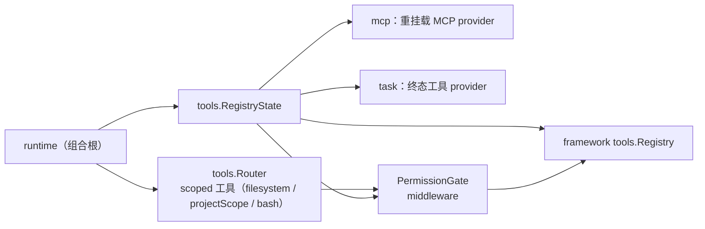
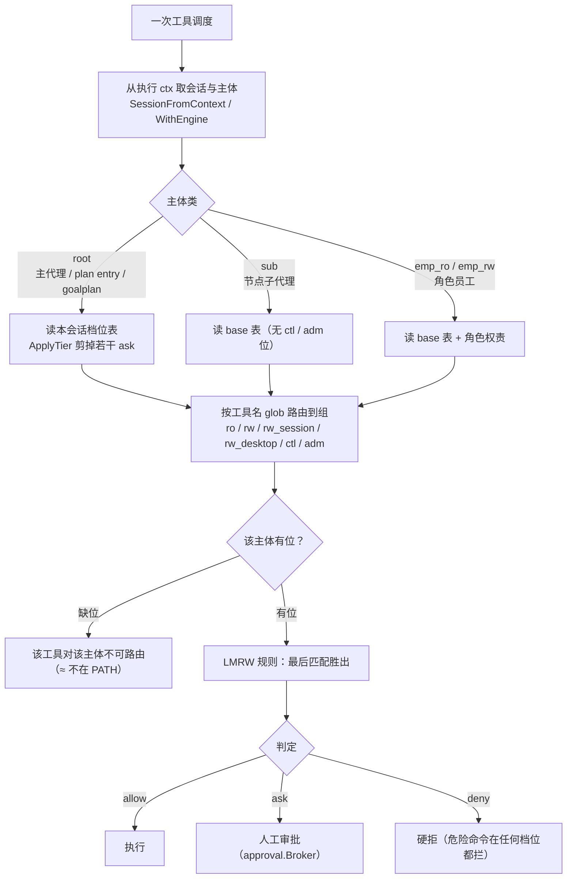

# tools 域

## 生态位

承载 scoped 工具路由与工具注册表状态：受项目根限制的
read/grep/glob/write/edit/bash 工具族（`Router`）、内联工具 provider
（`RegistryState.AddInline`）、权限门控（`PermissionGate`）。主要调用方：
`runtime.go`（RegisterBuiltins、seelexVisibilityPolicy）。

## 职责与非职责

- 职责：`Router` 注册并路由项目作用域工具；`RegistryState` 包装
  framework tools.Registry（超时/中间件/内联工具）；`PermissionGate`
  做工具调度前的权限检查（allow/deny/ask）；`async_*.go`（表 / 执行体 / 工具面 / 探针
  四份）承载 bash 的
  后台命令执行域（轮询型，受 `limits.async_exec.enabled` 管辖；出厂配置 **true**，
  结构零值仍 false = 旧配置缺这段时能力不出现）。
- 非职责：MCP 工具生命周期（归 mcp 域）、plan 工具族（归 plan 域）。

## 与其它域的关系



## 权限判定链（主体 × 路由组 × 位）



## 核心实现

- `Router`：Deps 闭包注入 Runtime 能力（filesystem/projectScope/docker
  恢复/诊断），注册 read/write/bash 等工具。路径根解析顺序：worktree 节点作用域
  （`NodeScope.WorkspaceID`）→ 执行 ctx 的**会话键**（`Deps.SessionKey`，生产为
  telemetry 会话 ID）对应的项目根 → 进程默认根。后台/并行会话因此不会借用视图
  会话的项目根（工作区污染回归见 `router_session_root_test.go`）。
- `RegistryState`：framework registry 包装 + `InlineProvider` 累积
  RegisterTool 产品工具（重名覆盖、快照重建）。
- `PermissionGate`：middleware 闭包捕获，运行时原子更新。**权限档位按会话解析**（`SetPermissionTierFor` / `PermissionTierFor` / `effectiveTierLocked`，空会话 ID = 进程级默认面）：middleware 由执行 ctx 取会话（`SessionFromContext`）后按"主体类 + 会话档位"选 checker——root 读本会话档位表（`permission_tiers.go:ApplyTier` 剪掉若干 ask），`sub`/`emp_*` 一律读 base 表；`full` 档的执行门短路**只对 root**（`Enforce` 条件 `class == root`），所以 A 会话切档不会放行 B 会话、员工越权也不会被 `full` 档连带放行（回归见 `permission_tiers_test.go`、`permission_session_isolation_test.go`、`permission_state_test.go`）。`SetFullAccess*` / `FullAccessFor` 保留为兼容壳（⇔ `full`/`manual` 档）。
- `computer/`（子包）：桌面 computer use 原语 + Seelex 侧工具族（`computer_*`）；
  工具面只依赖注入闭包（注册面/媒体分区/随图队列），原语平台无关桩保持跨平台
  可编译。输入注入类工具对子代理不可见（见 `policy.go` 的
  `isComputerInputTool`）。

### 后台命令（轮询型，`async_exec.go` / `async_run.go` / `async_tools.go` / `async_probe.go`）

形状：`bash background=true`（**必须带 `description`**，一句话说明这条命令在干什么——
它是工作打点表的行标题，没有别的诚实来源）只返回**受理回执**（`{status:accepted, handle,
log_path, state:running}`，不含命令输出），`tool_call`/`tool_result` 的配对就在这一次调用
里完成；模型想看进展就自己再调 `async_output(handle, wait_ms)`，想终止就调
`async_kill(handle)`。每一问一答都是正常的相邻工具对，所以历史只追加、不回写，也不需要
"结果到达时把空闲会话叫醒"那条链路（它必然回闯 `ChatStream` 全程持有的会话锁）。选型与
实测见
[`docs/2026-09-24-async-tool-deferred-ack/README.md`](../../docs/2026-09-24-async-tool-deferred-ack/README.md)
§0（P4/P5 证明迟到 `role=tool` 在 wire 层非法，P7 证明轮询形态不破前缀缓存）与 §10。

文件分工按"表 / 执行体 / 工具面 / 探针"四份（`async_exec.go` 单文件曾长到 608 行且职责混合，
命中仓库根 `MEMORY.md` 的上帝文件判据）：

- `async_exec.go`：句柄表与状态机（`running/done/failed/killed`）、载荷渲染。
- `async_run.go`：派发、`awaitAsync` 收尾、进程树与输出目录回收。
- `async_tools.go`：`async_output` / `async_kill` 两个 handler 与 schema/描述。
- `async_probe.go`：只读探针（`AsyncRuns` / `AsyncRunEvents`）——回答界面上的
  "是什么、在跑什么、现在怎么样"，不推进游标、不进上下文。

- `asyncRegistry`：单锁句柄表。句柄 `a<seq>`（seq 单调，不能用 `len(runs)` 推——驱逐过
  已完成项后会同号，两条执行共用输出文件）；去重键 = 会话+命令（只在 `state=running`
  期间生效，一次失败不得永久封死这条命令）；在途上限 32、记录槽 256，驱逐最老的已完成
  记录时**连带删输出文件**（记录槽有上限、文件没有，否则长会话把临时目录无界撑大）。
  `begin`/`snapshot` 都按值返回副本：表内那条记录的 `state/exit` 由执行体收尾在锁内改写。
- 执行体：`context.WithoutCancel` + 自带 `asyncHardCap=30m`。同步路径的
  `scopedToolTimeout` 在这里不适用——受理回执一返回，本次工具调用的 ctx 就失效，沿用
  它会立刻杀掉刚起的命令。硬超时合成 `exit=124`、被杀合成 `exit=137`，两者都把注记写进
  输出文件（否则模型只看到"命令突然结束"）；正常退出、硬超时、被杀、执行体 panic 四条路
  都必须落到 `finish` 恰好一次。
- **进程树终止靠 `security.ProcessTree`（Windows = Job Object，POSIX = 进程组）**：
  `exec.CommandContext` 到点只杀直接子进程（bash），`taskkill /T` 也杀不到——MSYS2/Git Bash
  的 fork 子 shell 不一定挂在直接父进程下，实测 `bash -c "(sleep 0.5; echo GRANDCHILD) &
  sleep 25"` 在 150ms 被 `/T` 杀掉后 GRANDCHILD 仍落进日志。Job Object 不看父子关系，
  且 `KILL_ON_JOB_CLOSE` 让"执行体收尾时关句柄"成为唯一确定的回收点。Job 建不出来时
  退化成按 PID 杀，`Degraded()` 说得清——此时不得主张"整棵进程树已终止"。
- `cappedLogWriter`：输出在 1MiB 处截断，超上限只丢字节、**仍向子进程报告已消费**
  （报短写会让命令自己异常退出，那是把基础设施限制伪装成命令失败）。
- 增量交付：`cursor` 是"已交付给模型的文件偏移"，每次取回最多带 4000 字符的**新增**
  部分——反复轮询同一句柄不会把整份日志重播进上下文（这是轮询型唯一真实的 token 风险）。
- 会话销毁即杀：`Router.CloseSessionAsync(sessionID)` 由 `Runtime.ReleaseSessionAsync`
  转给 core，在会话删除/归档时调用。句柄表按会话持有执行体，会话没了就没有任何取回/终止
  入口——不杀就是无人认领的孤儿进程，而工作打点表会一路显示 running。
- `AsyncPendingFor(sessionID)`：只读计数本会话在途执行。它是 core"无进展预算"的判据输入：
  异步载荷刻意不含时间戳（含了就每轮白烧前缀缓存），所以一条**安静**的长命令的两次取回
  必然逐字节相同，按载荷字节算进展会把还在跑的回合判死。
- 实时探针（`async_probe.go`）：`AsyncRuns()` 把登记表采样成"是什么（description）、
  在跑什么（command）、现在怎么样（state / exit / 已产出字节 / 末行 / 耗时 / 是否降级）"，
  `AsyncRunEvents()` 是它的变化信号口（容量 1、latest-wins）。三类来源发信号：派发与终态
  （`begin`/`finish`）、以及**有新字节**（`cappedLogWriter` → `noteOutput`，按
  `asyncProbeThrottle=1s` 去抖；安静没输出的命令不刷信号）。探针不推进 `cursor`，也不进
  上下文——命令行原文、绝对路径、时间戳只到 GUI；`asyncPayload` 那份仍受"确定性、不含
  路径"的缓存纪律约束。core 侧的投影见 `application/core/work_table_async.go`。
- 开关（`Deps.AsyncExecEnabled` ⇐ `limits.async_exec.enabled`，**出厂 true**；结构零值仍
  false，旧配置文件缺这段 = 关）：关闭时三处同时收起——`bash` schema 不下发 `background`、
  `async_output`/`async_kill` 不注册、handler 收到 `background=true` 直接报错。
  **关就是关**，不得静默降级成同步执行（与 `security/sandbox.go` 头注同源）。
  常驻开的已知代价：三个入口的 schema 每轮常驻，实测让每轮 prompt 多约 213 token。

## Review 要点（本域最容易出错的地方）

- `state/exit/killRequested/cmd` 只能在 `g.mu` 内读写；终止动作（taskkill / TerminateJobObject）
  必须在锁外做——`finish` 也要这把锁。
- `killed` 意图只能在终止**确认成功**后落（`markKilled`），否则状态会跑在进程前面。
- 载荷新增字段前想清楚：它会永久留在可缓存前缀里，任何"每次都不一样"的字节都在白烧预算。
- 派发返回前若 `attach` 没落上（记录被驱逐/关停），执行体必须自己 `tree.Close()`，否则漏 Job。
- 探针读表（`infos`）只能在锁内取字段，文件 `stat`/读末窗一律在锁外做——一条狂写日志的
  命令不得挡住派发与收尾。信号是**非阻塞**发送（持 `g.mu` 时），消费者慢就让它丢，
  读侧自己汇聚。
- `asyncProbeThrottle` 只限制发信号的频率，不参与"进程还活着吗"的判断；终态一律由
  `cmd.Wait` 的返回说话。新增按墙钟猜状态的判据一律拒绝。
- 给后台执行加字段时先说清它属于哪一层：`asyncRun`（表）→ `AsyncRunInfo`（探针，可带
  路径/时间/命令原文）→ `asyncPayload`（进上下文，必须确定性、不含路径）。三层字段混用
  就是拿缓存预算换界面便利。

## 数据流

RegisterBuiltins → Router.Register → framework registry；每次工具调度 →
permission middleware → handler → 诊断/遥测钩子。

## 依赖方向

允许依赖：`fs`、`security`、`internal/model`、`framework tools`、
`framework types`。禁止依赖：seelebridge 根包及其它域。

## 并发、存储、安全

`Router`/`PermissionGate` 自带锁；路径经 `security.ProjectScope` 校验；
bash 诊断观察者 panic 隔离。后台命令：`asyncRegistry` 单锁（执行体 goroutine 只写
自己那条，读侧在 handler 里）；句柄只对本会话有效，跨会话取回直接拒绝；执行体脱离
工具 ctx（`context.WithoutCancel`），存活上限由 `asyncHardCap` 自带；输出目录归本进程，
`CloseAsync` 当场试删，删不动（还有句柄没关）就由最后一条 `finish` 补删，关停后
`begin` 直接报错而不是新建一个没人回收的目录。`async_output` 归只读权限组：取的是
本会话里**已获批那次派发**的输出，因此不重复弹审批。

## 扩展方式

新增 scoped 工具：扩展 `Router.Register`；新增内联产品工具：`AddInline`。
后台能力（如 `agent_run background=true`）应复用 `asyncRegistry` 的形状——派发回执
必须在自己的单元内完成配对，不得引入"迟到补记"写回历史中段的链路。

## Review 指南

- 路径是否可能逃逸项目根；权限中间件是否在注册表构造时正确闭包捕获。
- 后台执行体**不得**继承工具调用的 ctx 或 `scopedToolTimeout`（回执一返回该 ctx 就
  失效）；新增清理路径都要问"终态是否恰好合成一次"。
- 回执与取回的载荷必须确定性（不含时间戳/耗时）：这些字节会永久留在可缓存前缀里。
- 取回只能交付增量并推进 `cursor`；把整份日志重播进上下文会同时烧 token 和破前缀。
- 开关新增一处生效就要同步三处（schema / 注册 / handler），且关闭态必须报错而非降级。

## 测试与验证

`go test ./seelebridge/tools/...`（router_test、permission_state_test、
async_exec_test：回执不含输出、增量拼接恰好一次、跨会话拒绝、未知句柄报错、去重只在
在途、在途上限、驱逐连带删日志、截断不报短写、wait_ms 归一、开关三处同步、权限组）。
真实 API 的形态与经济性冒烟（opt-in，不进 CI）：

```text
# wire 层：P1–P7（轮询形态合法且不破前缀缓存）
go test -tags asynclive . -run TestAsyncWire -count=1 -v
# §8.3 五指标 A/B（两臂只差 limits.async_exec.enabled）
go test -tags manualsmoke . -run TestManualSmokeAsyncAB -count=1 -v -timeout=60m
```
