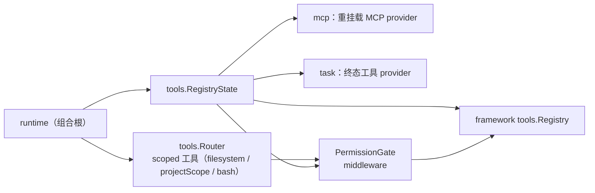
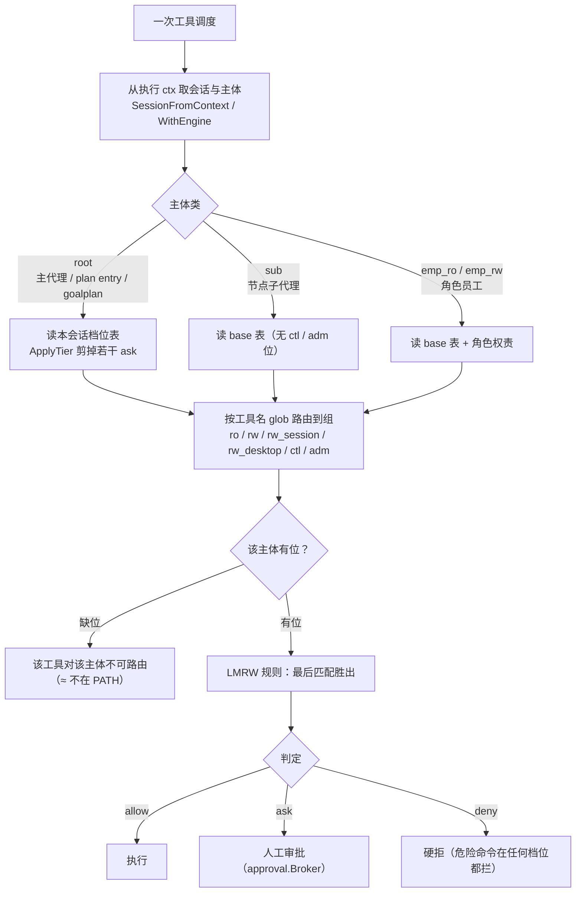

# tools 域

## 生态位

承载 scoped 工具路由与工具注册表状态：受项目根限制的
read/grep/glob/write/edit/bash 工具族（`Router`）、内联工具 provider
（`RegistryState.AddInline`）、权限门控（`PermissionGate`）。主要调用方：
`runtime.go`（RegisterBuiltins、seelexVisibilityPolicy）。

## 职责与非职责

- 职责：`Router` 注册并路由项目作用域工具；`RegistryState` 包装
  framework tools.Registry（超时/中间件/内联工具）；`PermissionGate`
  做工具调度前的权限检查（allow/deny/ask）。
- 非职责：MCP 工具生命周期（归 mcp 域）、plan 工具族（归 plan 域）。

## 与其它域的关系

## 权限判定链（主体 × 路由组 × 位）

## 核心实现

- `Router`：Deps 闭包注入 Runtime 能力（filesystem/projectScope/docker
  恢复/诊断），注册 read/write/bash 等工具。路径根解析顺序：worktree 节点作用域
  （`NodeScope.WorkspaceID`）→ 执行 ctx 的**会话键**（`Deps.SessionKey`，生产为
  telemetry 会话 ID）对应的项目根 → 进程默认根。后台/并行会话因此不会借用视图
  会话的项目根（工作区污染回归见 `router_session_root_test.go`）。
- `RegistryState`：framework registry 包装 + `InlineProvider` 累积
  RegisterTool 产品工具（重名覆盖、快照重建）。
- `PermissionGate`：middleware 闭包捕获，运行时原子更新。**权限档位按会话解析**（`SetPermissionTierFor` / `PermissionTierFor` / `effectiveTierLocked`，空会话 ID = 进程级默认面）：middleware 由执行 ctx 取会话（`SessionFromContext`）后按"主体类 + 会话档位"选 checker——root 读本会话档位表（`permission_tiers.go:ApplyTier` 剪掉若干 ask），`sub`/`emp_*` 一律读 base 表；`full` 档的执行门短路**只对 root**（`Enforce` 条件 `class == root`），所以 A 会话切档不会放行 B 会话、员工越权也不会被 `full` 档连带放行（回归见 `permission_tiers_test.go`、`permission_session_isolation_test.go`、`permission_state_test.go`）。`SetFullAccess*` / `FullAccessFor` 保留为兼容壳（⇔ `full`/`manual` 档）。
- `computer/`（子包）：桌面 computer use 原语 + Seelex 侧工具族（`computer_*`）；
  工具面只依赖注入闭包（注册面/媒体分区/随图队列），原语平台无关桩保持跨平台
  可编译。输入注入类工具对子代理不可见（见 `policy.go` 的
  `isComputerInputTool`）。

## 数据流

RegisterBuiltins → Router.Register → framework registry；每次工具调度 →
permission middleware → handler → 诊断/遥测钩子。

## 依赖方向

允许依赖：`fs`、`security`、`internal/model`、`framework tools`、
`framework types`。禁止依赖：seelebridge 根包及其它域。

## 并发、存储、安全

`Router`/`PermissionGate` 自带锁；路径经 `security.ProjectScope` 校验；
bash 诊断观察者 panic 隔离。

## 扩展方式

新增 scoped 工具：扩展 `Router.Register`；新增内联产品工具：`AddInline`。

## Review 指南

- 路径是否可能逃逸项目根；权限中间件是否在注册表构造时正确闭包捕获。

## 测试与验证

`go test ./seelebridge/tools/...`（router_test、permission_state_test）。
