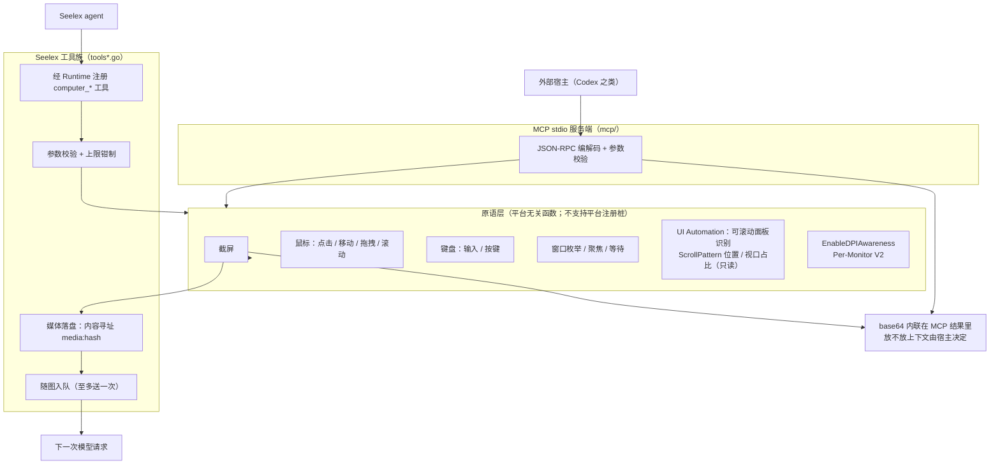
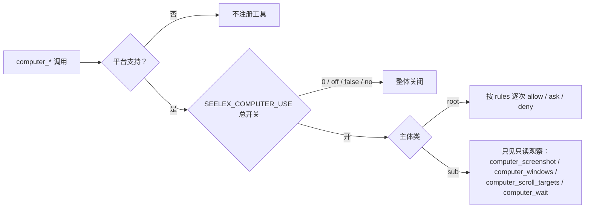

# Computer（桌面 computer use 原语）

## 生态位

`seelebridge/tools/computer` 提供桌面 computer use 的**原语层**：截屏、鼠标、
键盘、窗口枚举与聚焦；同一个包再往上承载 **Seelex 侧工具族**（`tools*.go`）。
两个消费面共用同一套原语，差异只在"图像怎么送到模型"：

| 消费面 | 调用方 | 图像通道 |
|---|---|---|
| MCP stdio 服务端（`mcp/`） | Codex 之类的外部宿主 | base64 内联在 MCP 工具结果里，由宿主自己决定放不放上下文 |
| Seelex 工具族（`tools*.go`） | Seelex 自己的 agent（经 `seelebridge.Runtime` 注册） | 存进会话媒体分区（`media:<hash>`），再经 `imageattach` 队列随**下一次模型请求**送入（至多送一次） |

## 架构图



## 门控与权限



## 职责与非职责

职责：

- 把「看屏幕、动鼠标、敲键盘、找窗口」封装成可测试的 Go 函数；
- 用 **UI Automation** 只读回答「页面里哪些面板可以滚轮操作、滚到哪一段、屏幕外
  还有多少内容」（`computer_scroll_targets`），让滚轮有落点、有回读；
- 坐标语义统一为虚拟桌面（多显示器并集）物理像素，进程启动即声明
  Per-Monitor V2 DPI 感知（`EnableDPIAwareness`），避免坐标被系统缩放虚拟化；
- 在 MCP 层做 JSON-RPC 编解码与工具名/参数校验；
- 在工具层做参数校验、上限钳制、媒体落盘与随图入队（工具族清单见下）。

刻意不做什么：

- 不做业务判断、不做安全审批、不决定"该不该点"——边界由宿主与用户审批负责；
- 工具层不依赖 `seelebridge` 上层：注册面、媒体分区、随图队列全部由 `Deps`
  闭包注入（因此本包保持跨平台可编译、可单测）；
- 不回写会话正文、不读取模型上下文（只把画面交给随图队列）；
- 不替模型决定"该滚哪个面板"：UI Automation 查询只报事实（名字、控件类型、矩形、
  滚动位置与视口占比），选哪个面板、滚多少仍由模型决定；
- 不实现截图压缩策略之外的图像处理。

## 文件结构

| 文件 | 职责 |
|---|---|
| `computer.go` | 领域类型（`Point`/`Rect`/`Capture`/`ClickOptions`）与 `Sleep`；平台无关。 |
| `image.go` | 最近邻缩放（只影响给模型看的像素，不改坐标系）。 |
| `view.go` | 看图原语 `ViewImageFile`：读本地图片、必要时降采样重编码；只读、不拷贝，失败原因显式分类。 |
| `keys.go` | 虚拟键码与组合键解析（跨平台可测）。 |
| `click.go` | 点击序列语义：按下/释放成对、失败必补释放。平台无关、可单测。 |
| `scrolltarget.go` | 可滚动面板的领域类型（`ScrollTarget`/`ScrollAxis`）与纯函数：过滤、按面积排序、点命中取最内层、轴状态派生（到顶/到底）。平台无关、可单测。 |
| `uia_windows.go` | UI Automation 客户端（Windows）：手写 COM vtable 调用，枚举窗口子树里的可滚动面板、读滚动位置、按点回读落点面板。 |
| `screen_windows.go` / `stub_other.go` | 截屏与 DPI 感知（Windows 实现 / 非 Windows 返回 `ErrUnsupported`）。 |
| `input_windows.go` | 鼠标与键盘注入（SendInput）。 |
| `window_windows.go` | 顶层窗口枚举、矩形、状态与聚焦。 |
| `mcp/main.go` | MCP stdio 服务端：`initialize` / `tools/list` / `tools/call`。 |
| `tools.go` | Seelex 侧工具族的装配面：`Deps`（注册面/媒体分区/随图队列）+ 十一个工具名常量 + 注册 + 共享 helper。 |
| `tools_view.go` | 观察类工具：`computer_screenshot`（截屏 → 媒体分区 → 随图）、`computer_windows`、`computer_focus`。 |
| `tools_input.go` | 输入类工具：`computer_click` / `computer_move` / `computer_drag` / `computer_scroll` / `computer_type` / `computer_keys` / `computer_wait`。 |
| `tools_scroll.go` | 滚轮工具面：`computer_scroll_targets`（可滚动面板清单）与滚轮动作的落点回读投影。 |
| `tools_schema.go` | 十一个工具的 JSON Schema（参数名、单位与坐标语义是模型可见契约）。 |
| `tools_test.go` | 工具层单测（原语注入假实现，任何平台都能跑）。 |
| `scrolltarget_test.go` | 可滚动面板纯函数单测（过滤/排序/点命中/滚轮分格），任何平台都能跑。 |
| `tools_scroll_test.go` | 滚轮工具契约单测：面板清单、窗口匹配、滚前/滚后回读、缺省落点。 |
| `tools_desktop_probe_test.go` | 真机桌面冒烟（默认跳过，`SEELEX_COMPUTER_DESKTOP_PROBE=1` 才跑）。 |
| `scrolltargets_desktop_probe_test.go` | 真机 UI Automation 探针（默认跳过）：枚举真实窗口的可滚动面板并验证点命中回读。 |

### Seelex 侧工具族（`tools*.go`）

| 工具 | 形状 | 说明 |
|---|---|---|
| `computer_screenshot` | 截屏 → `media:<hash>` + 随图 | 画面进会话媒体分区，并挂进"下一次请求"；结果只回引用、区域/缩放、光标与前台窗口 |
| `computer_windows` | 只读 | 可见顶层窗口列表（缺省过滤不可见窗口）+ 虚拟桌面 + 前台窗口；`match` 过滤、`limit` 上限 60 |
| `computer_scroll_targets` | 只读 | 窗口里可用滚轮操作的面板清单：名称/控件类型/矩形/中心坐标 + 纵向横向的滚动位置与视口占比（`at_start`/`at_end` 直接标出有没有更多内容）；`window` 按标题匹配（不聚焦）、`limit` 上限 40 |
| `computer_focus` | 输入 | 按标题子串置前；空 match 只报告当前前台窗口 |
| `computer_click` | 输入 | `x/y` 或 `window`（聚焦后点窗口中心）；`button` left/right/middle，`clicks` 1-3 |
| `computer_move` | 输入 | 移动指针（hover / 拖拽预备） |
| `computer_drag` | 输入 | 按住左键从 `from` 拖到 `to` 再释放（中途失败也补释放） |
| `computer_scroll` | 输入 | 在 `x/y` 滚轮（给 `window` 时先聚焦并滚该窗口最大的纵向可滚动面板；两者都没有则用光标处）；`delta` 以 WHEEL_DELTA=120 为单位、按格下发，正数向上；结果回读落点面板的滚前/滚后位置 |
| `computer_type` | 输入 | 字面文本注入（UTF-16，支持中文与 emoji），单次上限 4000 字符 |
| `computer_keys` | 输入 | 组合键（`ctrl+shift+t`、`enter`…），重复 1-10 次 |
| `computer_wait` | 只读 | 等待 UI 稳定（上限 10s），随后应重新截图而不是假设动作生效 |

开关与门控：

- 平台：非 Windows 不注册（`Supported() == false`，宁可不给也不挂一串必然失败的摆设）；
- 环境：`SEELEX_COMPUTER_USE=0|off|false|no` 整体关闭（无头/CI 场景）；
- 权限：`config/seele.yaml` 的 `permission.rules` 逐次 allow/ask/deny（默认 `* → ask`，
  本仓库给 `computer_*` 写了显式规则：只读观察（截屏/窗口/可滚动面板）也 ask，
  `computer_wait` allow）；`computer_scroll_targets` 只读，因此归 `ro` 组而不是
  `rw_desktop` 组——它不注入任何输入；
- 可见性：输入注入类工具对子代理不可见（并行子代理共用一块桌面会互相打断），
  观察类工具对子代理保持可见，且截到的画面只进**执行会话自己**的随图队列。

## 核心实现

- **输入注入走 `SendInput`，不走 `mouse_event`**：`SendInput` 返回真正插入队列
  的事件数，调用方因此能判断成功/失败；`mouse_event` 返回 `void`，把它的
  返回值当失败判断会让每一次点击都"假失败"。`runClickSequence` 另外保证按下
  与释放成对：按下失败时也补发一次释放，避免鼠标停在按下状态（桌面进入拖拽）。
- **绝对坐标归一化**：`absolutePoint` 按虚拟桌面尺寸把物理像素映射到
  `0..65535`，配合 `MOUSEEVENTF_ABSOLUTE|MOUSEEVENTF_VIRTUALDESK`。
- **DPI 感知**：`EnableDPIAwareness` 用 `SetProcessDpiAwarenessContext`
  声明 Per-Monitor V2；不声明时 125% 缩放下注入坐标会落到目标的 80%。
- **键盘文本**：`TypeText` 按 UTF-16 单元逐个注入（支持中文与 emoji），
  组合键由 `PressKeys` 解析后按"修饰键按下 → 主键 → 修饰键逆序释放"下发。
- **看图只读、截图才拷贝**：`ViewImageFile` 既不写盘也不留副本，路径失效时
  只能显式报错（`ErrImageNotFound` / `ErrImageNotFile` / `ErrImageEmpty` /
  `ErrImageFormatUnsupported`，各自可 `errors.Is` 判定）；按 `MaxWidth`
  降采样时只重编码「给模型看的那份字节」，原文件字节不变。
- **滚轮作用于指针下方的控件**：因此 `computer_scroll_targets` 先回答"哪些面板
  能滚、滚到哪了"，`computer_scroll` 再按点（或按窗口里最大的纵向面板）注入，
  并在滚完读回同一块面板的位置——"滚了但已经到头"和"压根没滚到可滚动区域"
  在结果里是可区分的（`moved` / `at_start` / `at_end`）。读不到就显式
  `unavailable: ["scroll_panel"]`，不编造状态。
- **UI Automation 只读查询**：`uia_windows.go` 手写 COM vtable 调用
  （`IUIAutomation` / `IUIAutomationElement` / `IUIAutomationElementArray` /
  `IUIAutomationTreeWalker` / `IUIAutomationScrollPattern`），vtable 槽位按
  Windows SDK 10.0.22621 的 `UIAutomationClient.h` 硬编码并逐条注明方法名。
  只调用读入口（`FindAll` / `GetCurrentPropertyValue` 等）与 `get_Current*`，
  不注册事件、不写 UI 状态、不调用 `Scroll`/`SetScrollPercent`——滚轮始终走
  `SendInput`，与"真人滚一下"同一条路径。
- **Chromium 的懒构建可访问性树**：Chrome/Edge 的可访问性树是懒构建的，冷启动
  时 `FindAll(IsScrollPatternAvailable)` 只看得到工具栏那一小块（同一窗口实测
  1 个 vs 3 个可滚动面板）；VS Code 更极端——快路径只回 Monaco 列表行，拿不到
  编辑器主区，按"最大面板"选落点就会选错行。因此查询分两步：先按属性条件
  `FindAll`（数百毫秒），**当且仅当**候选里没有一个覆盖到窗口面积 20% 以上的
  "主面板"（或一个候选都没有）才退回**有界**的 raw view 深度优先遍历（节点
  ≤3000、深度 ≤32、≤3s），并把两批结果按矩形+控件类型去重合并。主面板在场时
  不遍历（Qoder 实测 134ms）。
- **只报面板，不报滚动项**：面积小于 `minScrollTargetArea`（≈64×64 像素）的元素
  不算滚轮目标——Chromium 的虚拟列表会把每一行都标成 `IsScrollPatternAvailable`
 （VS Code 的 Monaco 行 170×22=3740px²），那是滚动**项**。点命中回读不受此限：
  指针落在哪个面板上就报哪个面板。
- **每次查询一个 COM 单元**：COM 接口有线程亲和性，而 goroutine 会在 OS 线程间
  迁移，因此每次查询都在 `runtime.LockOSThread()` 的线程上
  `CoInitializeEx(MTA)` → `CoCreateInstance(CUIAutomation)` → 用完
  `CoUninitialize`，接口指针不跨调用复用（`withUIAutomation`）。所有查询都有
  超时（`DefaultScrollTargetTimeout` 5s = 快路径 + 遍历预算；滚动回读 2s），
  跨进程调用被目标进程拖住时返回显式错误而不是把一次工具调用挂死。
- **MCP 侧一次调用给全「页面状态」**：`view_screen` 把截屏与虚拟桌面、光标、
  前台窗口绑成一条工具，`view_image` 负责「入参路径、出参图像内容」；两者都
  支持 `inline_image=false` 只回路径与尺寸，避免把图像塞进不需要它的上下文。
  内联有 `maxInlineImageBytes`（8 MB）封顶：超限就退回文本并提示降 `max_width`，
  而不是把一行 JSON 撑到读不回来。

## 数据流

MCP 宿主 → `mcp/main.go` 解析 JSON-RPC → 校验参数 → 调用原语
（`CaptureShot`/`Click`/`Drag`/`Scroll`/`TypeText`/`ListWindows`/`ViewImageFile`）
→ 结果编码为 MCP `content` 文本、图像内容或 PNG 保存路径 → 返回宿主。

- `screenshot`：截屏 → 落 PNG（默认 `%LOCALAPPDATA%\codex-computer-use\shots`）
  → 文本（路径/区域/尺寸/缩放/光标）+ 图像内容（`inline_image` 默认 true）。
- `view_screen`：`screenshot` 的复合形式——同一份画面外加 `describeScreenState()`
  汇总的虚拟桌面、光标、前台窗口，一次调用即「画面 + 当前在哪」。
- `view_image`：只读取调用方给的路径（不拷贝）→ 必要时降采样 → 图像内容。
  截图与看图因此分工明确：截图产出资产，看图消费任意路径上的图片。

可滚动面板（UI Automation 只读）：

```text
computer_scroll_targets(window?)
  → 原语 ListScrollTargets（ElementFromHandle → FindAll(IsScrollPatternAvailable)
     → 没有"主面板"（覆盖 <20% 窗口面积）时才跑 raw view 有界树遍历，再合并去重）
  → 每块面板读 BoundingRectangle / Name / LocalizedControlType / AutomationId /
     ClassName / IsOffscreen，并从 ScrollPattern 读 percent 与 viewSize
  → NormalizeScrollTargets：丢掉两轴都不可滚/零面积的，按面积降序（外层在前）限流
  → 回给模型：name / control_type / rect / center（可直接当 computer_scroll 的 x/y）/
     vertical·horizontal{scrollable, percent, view_size, at_start, at_end}

computer_scroll(x/y | window | 光标处, delta)
  → 滚前 ScrollStateAtPoint（ElementFromPoint + 祖先链上找 ScrollPattern）
  → SendInput 按格下发 WHEEL_DELTA（scrollNotches：一格一格，避免超大 delta 被宿主截断）
  → 滚后再读一次 → 结果附 panel{vertical.before_percent, percent, moved, at_start, at_end}
```

回读的语义边界：`ElementFromPoint` 命中的是**该点最上层的窗口**，因此窗口被遮挡时
回读的是遮挡窗口的面板（这恰好等于滚轮真实会作用的对象），而 `window` 参数的枚举
不受遮挡影响。

Seelex 侧（`tools*.go`）：

```text
computer_screenshot
  → 原语 CaptureShot（DPI 感知 + 虚拟桌面坐标）
  → PNG 编码（BestSpeed）→ 字节上限校验（默认 8 MiB）
  → Deps.StoreMedia   落 (项目, 会话) 媒体分区 → media:<hash>
  → Deps.AttachImage  入 imageattach 队列（带字节的 image FilePart）
  → 下一次模型请求：Wrapper 把画面作为一条 user 消息附上（Take 即清空，至多一次）
  → 回给模型的结果：ref / 尺寸 / 缩放 / 区域 / 光标 / 前台窗口（不含 base64）
```

只带 `media:<hash>`（没有字节）的附件由 `Runtime.loadSessionMedia` 按同一会话/
项目口径读回，因此"引用"与"字节"两条路都能走通。

## 依赖方向

只依赖标准库与 Windows 系统库（`user32`/`gdi32`/`kernel32`，以及 UI Automation
所需的 `ole32`/`oleaut32` + `CUIAutomation` 组件）。不允许反向依赖
`seelebridge` 根包、`application/`、`session/` 等上层；非 Windows 平台由
`stub_other.go` 保持 `go build ./...` 可编译。

## 并发、安全与错误语义

- 原语是**有副作用的**：调用即真实操作桌面，不做并发隔离，调用方自行串行；
- UI Automation 查询是**只读**的：只枚举元素、读属性，不聚焦、不点击、不滚动、
  不改任何窗口状态；非 Windows 平台返回 `ErrUnsupported`；
  COM/跨进程调用的失败与超时都显式返回（`CoCreateInstance`/`FindAll`/超时各有
  独立错误文案），滚轮动作则把回读失败降级成 `unavailable`，不影响输入本身；
- 非 Windows 平台返回 `ErrUnsupported`，不 panic；
- 截屏写入路径由调用方给出，默认落在 `%LOCALAPPDATA%\codex-computer-use\shots`；
- 输入注入不校验目标窗口，权限由宿主的审批策略控制。
- Seelex 工具层：截屏没有落点（媒体分区不可用）或没有随图通道时**显式失败**，
  不做"截了但没人看得到"的无用功；参数越界（`clicks`、`times`、`delta`、
  文本长度、等待时长）一律报错或钳制，不静默改写用户意图；
- 归属由执行 ctx 决定，项目解析三级：执行会话绑定 → 节点作用域的工作区
  （子代理/Plan 节点没有独立会话绑定时用它）→ 默认项目 `""`；刻意不读 Router
  的活跃写作用域，也不用 `MainSessionID` 兜底——并行执行期间视图可能已切走，
  用它们解析会把截图写进另一个项目。随图队列按**执行会话**（子代理就是节点
  会话）投递，画面送给真正干活的 agent；`session_id` 为空直接报错。

## 扩展方式

- 新原语：先在 `computer.go` 定义类型与语义，再在 `*_windows.go` 实现、在
  `stub_other.go` 补桩，最后在 `mcp/main.go` 的 `tools/list` 与 `tools/call`
  登记；
- 平台无关的原语（如 `view.go` 的看图）只需新文件 + 单测，不必进
  `stub_other.go`；
- 新 MCP 工具同步补 `mcp/main_test.go`：直接调 `callTool` 断言 content 块，
  测试不依赖真实桌面；
- 新 Seelex 工具：在 `tools.go` 的 `Register` 加一行 + `tools_schema.go` 补
  schema + `tools_test.go` 补用例（原语注入假实现，任何平台都能跑）；
- 新 UIA 能力：先在 `uia_windows.go` 按 SDK 头文件核对 vtable 槽位与 IID，再在
  `stub_other.go` 补桩；能被"筛/排/判"的部分（过滤、排序、点命中、轴状态）一律
  放进 `scrolltarget.go` 做成纯函数，平台实现只保留系统调用；
- 新增或扩大 UIA 遍历范围时必须同时给节点预算与截止时间：跨进程遍历是
  O(节点数) 次调用，没有上限就等于把一次工具调用挂死；
- 只改平台实现的函数必须保持签名与坐标系语义不变（虚拟桌面物理像素）。

## Review 指南

- 系统调用的返回值语义是否被正确解读（`BOOL` 判 0、`SendInput` 判计数、
  `void` 不得参与判断）；
- 任何"按下"路径是否存在没有释放的出口；
- 新增坐标路径是否仍然 DPI 感知、是否仍以虚拟桌面为坐标原点。
- 手写 COM 调用：vtable 槽位是否与 SDK 头文件逐条对应（错一位就是调错方法）、
  每个 `Create*`/`FindAll`/`GetElement` 拿到的接口是否都 `Release`、`BSTR` 是否
  `SysFreeString`；新增 UIA 遍历是否带节点/深度/时间上限；
- 滚轮回读的语义：没有面板时必须显式 `unavailable`（不得假装滚到了）；
  `at_start`/`at_end` 只在真的可滚动时才置位。

## 测试与验证

```text
go test ./seelebridge/tools/computer/... -count=1
```

- `click_test.go`：点击序列（成对、失败补释放、clicks<1 归一）。
- `scrolltarget_test.go`：面板过滤/排序/限流、点命中取最内层、轴状态派生
  （不可滚动 ≠ 在顶部）、滚轮分格（含余数、上限截断）。
- `tools_scroll_test.go`：`computer_scroll_targets` 的窗口匹配（不聚焦）、面板
  过滤与 limit、空结果的键盘回退提示；`computer_scroll` 的滚前/滚后回读
  （`moved`/`before_percent`）、无面板时 `unavailable`、给了 `window` 时的
  缺省落点（最大纵向面板中心）。
- `view_test.go`：看图语义——原样返回文件原文、超宽降采样且**不改写原文件**、
  各类失败可 `errors.Is` 判定。
- `mcp/main_test.go`：MCP 工具面（不碰真实桌面）——`view_image` 的图像块可解码、
  `max_width` 生效、`inline_image=false` 只回文本、坏路径显式报错、
  `describeScrollTargets` 的清单渲染（名字缺失退回类名、边界标注、空结果回退），
  以及 `tools/list` 里 `view_screen`/`view_image`/`scroll_targets` 的描述非空。
- `desktop_probe_test.go`：默认跳过；设 `SEELEX_COMPUTER_DESKTOP_PROBE=1`
  才会在真实桌面上点一下并断言"不报错且左键已释放"（会夺走一次点击，
  只在本机手动验证时用）。
- `tools_test.go`：工具层契约——十一个工具全部注册且描述/schema 非空；截屏落盘
  （PNG 可解码、来源标记 screenshot、文件名带时间戳）并随图（ref/字节/尺寸
  与落盘一致）；`max_width` 钳制与 region 校验；窗口过滤/上限/单项降级；
  点击坐标解析（显式坐标 vs 窗口中心 vs 两者都缺）、按钮与次数校验；
  拖拽/滚轮/文本/组合键/等待的参数边界。
- `tools_desktop_probe_test.go`：默认跳过；`SEELEX_COMPUTER_DESKTOP_PROBE=1`
  时用**真实桌面**跑"截屏 → PNG → 落盘 → 随图"与窗口枚举（本机实测
  1536×864 虚拟桌面 → 1024×576 画面、82 KB PNG、10 个可见顶层窗口）。
- `scrolltargets_desktop_probe_test.go`：默认跳过；`SEELEX_COMPUTER_DESKTOP_PROBE=1`
  时用真实桌面**只读**枚举可滚动面板（可选 `SEELEX_COMPUTER_PROBE_WINDOW=<标题子串>`
  指定窗口，不聚焦），并用最大面板的中心做点命中回读断言。本机实测：Seelex 窗口
  3 个面板（对话区 `conversation` percent=100 / view_size≈7.35% 且 `at_end`，
  另有两条页签栏），Edge 的 DeepSeek 文档页 1 个（页面主体 percent=100 /
  view_size≈78.7%），Qoder 1 个（`消息列表` percent=100.44 / view_size≈12.5%，
  快路径 134ms），VS Code 走兜底遍历（快路径只回 Monaco 行）。

滚轮真实生效同样在真机上验过（临时探针，非随仓库提交）：对 Qoder 的 `消息列表`
面板中心注入一格 `delta=+120`，回读 100.439% → 97.251%；再注入 `delta=-120`
精确回到 100.439%，面板 class/rect 全程一致——滚轮注入与滚前/滚后回读都对得上。
