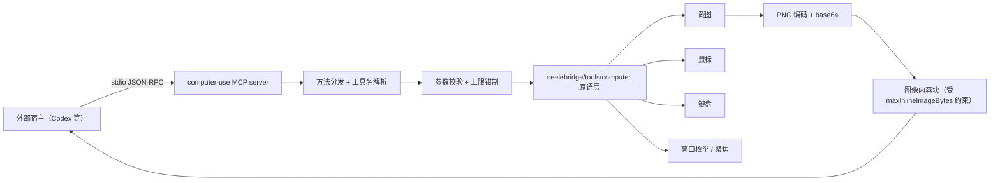
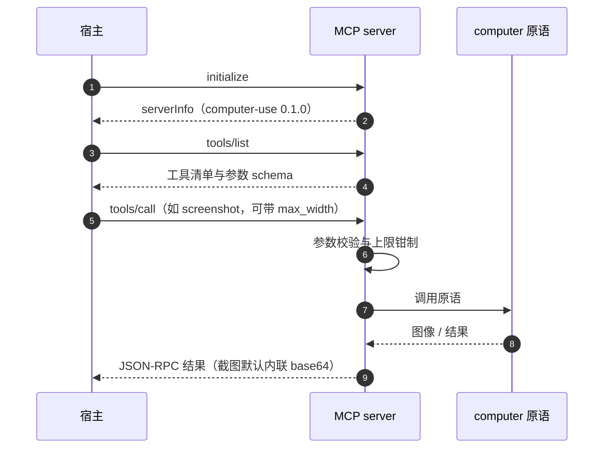

# seelebridge/tools/computer/mcp

## 生态位

`seelebridge/tools/computer/mcp` 是一个 **MCP stdio 服务端**：通过 JSON-RPC 把
桌面 computer use 原语（截图、鼠标、键盘、窗口枚举与聚焦）暴露给外部宿主
（例如 Codex）。

它是 `seelebridge/tools/computer` 原语层的两个消费面之一（另一个是 Seelex 自己的
工具族），两者共用同一套原语，差异只在「图像怎么送到模型」：

| 消费面 | 调用方 | 图像通道 |
|---|---|---|
| MCP stdio 服务端（本包） | 外部宿主 | base64 内联在 MCP 工具结果里，由宿主决定是否进上下文 |
| Seelex 工具族 | Seelex agent | 落会话媒体分区，经 `imageattach` 随下一次请求送入（至多一次） |

典型用法：

```text
codex mcp add computer -- <path>/computer-use-mcp.exe
```

## 职责与非职责

- 做：stdio 上的 JSON-RPC 编解码、工具名与参数校验、调用原语、把截图编码为图像内容。
- 不做：不做任何**业务判断**。安全边界由调用方（模型与用户审批）负责；
  服务端只做输入注入与截屏。

## 架构图



## 时序图



## 约束与错误语义

- `maxInlineImageBytes = 8 MiB`：单张图内联上限，base64 会再涨约 33%；
  超过上限应让调用方降低 `max_width`，而不是把一行结果撑到读不回来。
- `maxLineBytes = 32 MiB`：单行 JSON-RPC 消息上限。
- `defaultWidth = 1600`：截图默认宽度，可被请求覆盖。
- 服务端不持有会话状态，也不落盘；每次调用无副作用之外的持久化写入。

## 扩展方式

新增暴露的工具：在原语层加函数，再在本包注册工具名与参数 schema，并同步
[`seelebridge/tools/computer/README.md`](../README.md) 的工具清单。

## Review 指南

- 参数上限是否仍被钳制（宿主可能传任意大的尺寸或坐标）。
- 是否把「输入注入」当作可信操作（它不应自己做权限判断，但也不应假设宿主已授权）。
- 截图编码失败时是否显式报错，而不是返回空图像块。

## 测试与验证

```text
go test ./seelebridge/tools/computer/... -count=1
go build ./...
```
