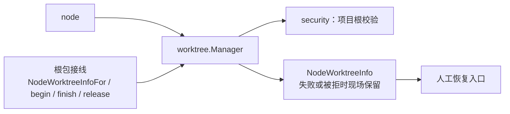
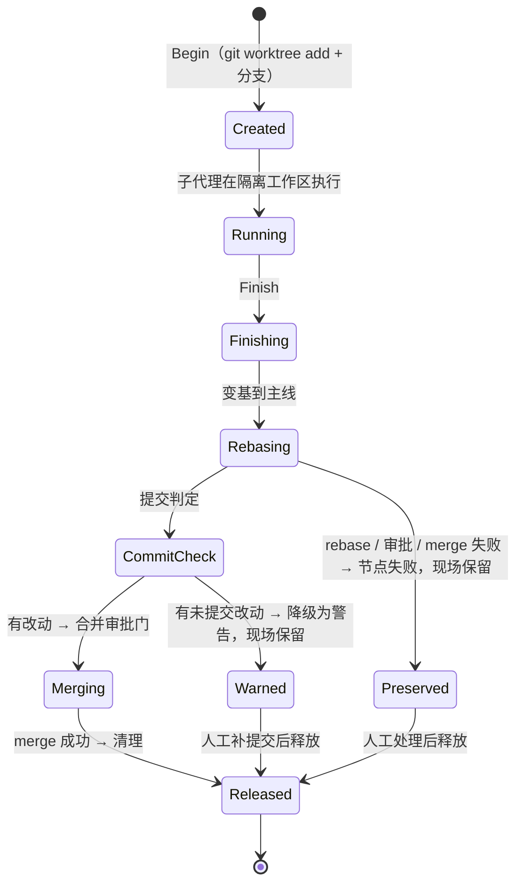

# seelebridge/worktree — 子代理 worktree 生命周期域

## 生态位

承载子代理节点的独立 worktree 生命周期：创建（Begin）→ 执行期间工作区隔离 → 收尾（Finish：变基 → 提交判定 → 合并审批 → merge → 清理）→ 释放（Release）。主要调用方：根包 `worktree.go` 门面、`node/` 域 `AgentNode.Run` 经 `Deps.Begin/Finish/ReleaseNodeWorktree`。

## 与其它域的关系



worktree 为 node 提供隔离工作区；生命周期由 node 编排、根包接线；失败/被拒
路径现场保留供恢复（NodeWorktreeInfo）。

## 生命周期状态



## 职责与非职责

职责：

- git worktree 创建/清理与分支管理；
- 收尾失败时保留"工作区现场"（注册表不释放，供前端展示与人工恢复）；
- 合并审批门注入（`WorktreeManagerDeps.Gate`）、阶段事件（`Phase`）。

非职责：

- 不决定节点何时开/关 worktree（调用方 `node/` 域决定）；
- 不实现 git 命令本身之外的版本控制策略；
- 不落盘会话数据。

## 目录或文件结构

| 文件 | 职责 |
|---|---|
| `worktree_manager.go` | `WorktreeManager`、`WorktreeManagerDeps`、`NodeWorktree`/`NodeWorktreeInfo`、`GitRunner`/`CleanupWorktree`/`ConflictFilesIn` |
| `worktree_manager_test.go` | fakeGit 驱动的生命周期单元测试 |
| `worktree_prune_test.go` | 残留回收（`Prune`）与幽灵现场（`Restore`）判据 |
| `worktree_failure_smoke_test.go` | B1/B2/B4 收尾失败现场保留冒烟 |

## 核心实现

`WorktreeManager` 内部单锁保护 `nodeID → NodeWorktree` 注册表；git 执行经可注入的 `git` 字段（默认 `GitRunner`，测试替换为 fakeGit）。

`Finish` 流程：`branchBehindBase` → 落后则 rebase（冲突报错保留现场）→ `commitCountSince` 判定 → 有提交则 `approve`（审批门可拒）→ **对齐合并目标分支**（`alignMergeTarget`：把主工作区切到现场记录的 `wt.MainBranch`）→ merge → `cleanup`；任一步失败返回可识别错误，调用方据此保留现场。

**"收尾要合到哪条分支"只有一个事实 = `NodeWorktree.MainBranch`**（建现场时记下）：变基目标、落后判定与合并目标三处读的都是它。合并前若不先把主工作区切回这条分支，`git merge` 就会合进主工作区**此刻碰巧所在**的分支——主工作区的当前分支在工作途中漂走时，同批先收尾的落在旧分支、后收尾的落在新分支，先前那份"已经合回来"的产出被踢成另一个分支上的孤儿（`worktree_merge_kickback_test.go`）。切不动一律显式收口：主工作区有在途改动挡路 → 可重试的 `ErrMergeBlockedByMain`，其余 → 硬失败带 git 原文、现场保留。

失败是**可分类**的：`commitCountSince` 判定为"工作区脏且无提交"（子代理未执行收尾协议 `git add -A && git commit`）时，返回包装了 `ErrUncommittedChanges` 的错误，并由 `IsUncommittedChanges(err)`（`errors.Is`）判定。语义边界：现场一律保留（绝不静默删除子代理产出），但该失败**不表示节点结论无效**——调用方（`node/` 域）据此把它降级为产出中的显式警告，避免 workplan fail-fast 取其失败连坐同批兄弟节点。其余失败（rebase 冲突、审批被拒、merge 冲突/失败）仍是硬失败，不可降级。

**残留回收（`Prune`）**：成功收尾才 `git worktree remove`，失败/中断的现场按设计保留，因此必须有兜底清理器，否则每个残留 = 一份完整检出 + 一个 `seelex/<id>` 分支，磁盘随历史失败数无界增长。`Prune` 走本仓库自己的 `git worktree list`，只回收**同时满足**两条的现场：

- **不在册**：注册表里没有它（发/收现场锚点）。恢复得到的现场由 `Restore` 先登记，因此不会被当残留删掉；
- **干净**：没有未提交改动。有改动的现场一律保留（`PruneResult.Kept`），与 `ErrUncommittedChanges` 同一口径——框架不替人决定产出「丢还是留」。

命名不属于本管理器（`<repoBase>-seelex-<nodeID>`）的 worktree 一律不碰；顺手跑一次 `git worktree prune` 清掉手工删目录留下的 prunable 元数据。**调用顺序是判据的一部分**：先 `Restore`、后 `Prune`（根包 `RestoreSubagentAnchors` 即按此顺序）。

**三个生命周期修正**：

- `Restore` 不再登记**目录已不存在**的路径：否则 `Info` 会报一个不存在的路径、`team_close` 收口步 2 会对着它跑 `git status` 而失败（幽灵条目）。
- `Begin` 对同一 `nodeID` **幂等**（已有在册现场直接复用），且不再对**仍在册**的路径做 `worktree remove --force`。路径与分支都只按 nodeID 命名，跨会话/跨批次的第二次 `Begin` 会指向同一目录，旧行为会把一个正在使用的现场删掉。
- `Finish` 的合并目标取自**现场记录**的 `MainBranch`（`alignMergeTarget`），不取主工作区当前所在的分支——后者是漂移的 ambient 状态，把同一批的产出散到不同分支上（"先前已合回来的那件被踢成另一个分支"）。

## 数据流或生命周期

`Begin(scope, nodeID)`（仅 RoleSubAgent；非 git 仓库降级共享工作区）→ `NodeWorktree` 注入 `NodeScope.WorkspaceID` → 节点执行 → `Finish` 成功则 `Release` 移除注册；失败路径注册表保留（`Info` 可查，`NodeWorktreeInfoFor` 暴露恢复入口）。

## 依赖方向

`worktree` → `security`（`ConfigureHiddenCommand`）、`internal/model`（`NodeScope`/角色）、`Seele approve`。**禁止反向依赖 seelebridge 根包**。

## 并发、存储、安全或错误语义

- 单锁 + git 子进程串行；60s git 超时防挂起；
- 失败保留现场是显式语义：`Release` 只由成功路径触发；
- 已知风险：脏判定用裸 `git status --porcelain`（`worktree_manager.go:798` 的 `pathDirtyWith`，**唯一实现**；组件 `w.pathDirty` / `w.worktreeDirty` 与包级 `PathDirty` 都转调它，全仓判定调用只剩这一行 `:799`），Windows/WSL 下 `.gitattributes` 未覆盖文件的 CRLF 转换可能造成"幻影脏"（待修复方向：CRLF 不敏感判定；语义变更要先有红灯用例，只在这一行改一处）。

## 扩展方式

- 注入替代 git 执行器（测试/远程环境）；
- 通过 `WorktreeManagerDeps.Gate` 接入不同审批门；
- 调整收尾策略（rebase 前是否强推、冲突处理提示）改 `Finish`。

## Review 指南

- 失败路径是否必然保留现场（不能误清理）；
- 审批门拒绝/超时是否不会删除 worktree；
- CRLF 幻影脏是否会被误判为"脏未提交"而中断节点；
- 脏未提交失败是否走 `ErrUncommittedChanges` 分类（调用方降级为警告），而不是与 rebase/审批/merge 硬失败混为一谈；
- 残留回收是否只删「不在册 **且** 干净」的现场，且调用方确实是先 `Restore` 后 `Prune`。

## 测试与验证

本包内：`worktree_manager_test.go`、`worktree_failure_smoke_test.go`（fakeGit，无真实 git 依赖）；真实 git 集成用例（根包 `worktree_test.go`）需本机 git，沙箱受限时按 skip 名单跳过。验证：

```text
go test ./seelebridge/worktree/ -count=1
go test ./seelebridge/... -count=1
```
