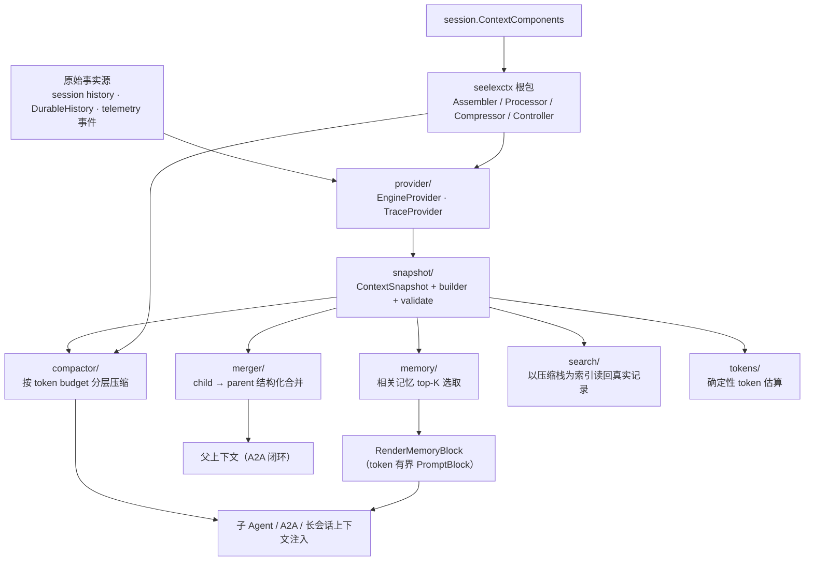
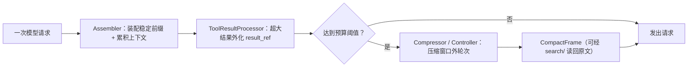

# Seelex Context

## 生态位

`seelexctx` 是 Seele v2 会话上下文契约（`seelectx`）的 Seelex 适配层与跨
父子 Agent 的上下文承袭门面。它把原始 history/遥测事件提炼为稳定
`ContextSnapshot`，支持预算压缩和 child-to-parent merge-back；同时把主会话
的装配/压缩/控制决策实现为 `seelectx` 的原子策略（Assembler/Processor/
Compressor/Controller），供 `session.ContextComponents` 注入。

## 架构图



## 数据流图



## 子模块

| 目录 | 职责 |
|---|---|
| [`snapshot/`](snapshot/README.md) | 上下文 DTO、builder、format 和 validate。 |
| [`provider/`](provider/README.md) | 从会话（SessionSource/DurableHistory）或 telemetry 导出 Snapshot。 |
| [`compactor/`](compactor/README.md) | 基于 token budget 的分级压缩。 |
| [`merger/`](merger/README.md) | 子任务 findings/decisions/progress 合并回父上下文。 |
| [`memory/`](memory/README.md) | 超长上下文的历史记忆选取：按当前查询从压缩帧选 top-K，渲染有界「相关记忆」块。 |
| [`lifecycle/`](lifecycle/) | 泛型 Context actor 与有界批处理管道；提供 cold-load/windowed/pipelined 策略和关闭竞态测试。 |
| [`tokens/`](tokens/README.md) | 脚本感知的 token 估算（零依赖、确定性，替代 len/3）。 |

根包文件：

| 文件 | 职责 |
|---|---|
| `assembler.go` | `RequestAssembler`：system prompt（effort/skill）+ PromptBlocks + working history 拼装；工具定义经 `AssembledRequest.Tools` 透传（引擎 API schema 通道，不渲染为消息文本）。 |
| `processor.go` | `ToolResultProcessor`：超大工具结果 → result_ref/省略警告。 |
| `compressor.go` | `Compressor` 适配：短历史免压缩 + QuickChat 隔离摘要。 |
| `controller.go` | `ContextController`：软/硬阈值、窗口外压缩、checkpoint 决策；帧生成优先走压缩 DAG（`ControllerOptions.Compaction`），旧本地路径保留兼容。 |
| `window.go` | 滑动窗口轮数策略（配置 + provider 推导）。 |
| `gap.go` | 真空区覆盖：滑动窗口与压缩内容之间的未压缩轮次，Load 时检测并压入合并帧。边界取自存储层选窗时回报的**尾窗起始单元下标**（与压缩栈顶 `To` 同一计数空间），不做跨列表减法，因此无需保守 clamp 与事后去重。下标必须落在单元空间内：尾窗起点超出 `[0, 单元数]` 或栈顶 `To < -1` 时报错返回、不落帧（不做越界切片）。 |
| `frame.go` | CompactFrame 两章节 Summary 纯函数（Chapter 1 链锚点 + Chapter 2 厚内容）、渲染截取、一句话摘要与 request 覆盖标签。 |
| `replay.go` | 前缀重放摘要协议：`PrefixReplaySummarizer` + QuickChat 实现（字节级同源素材由调用方保证）。 |
| `dag.go` | 压缩 DAG 执行器：codec 文档装配 + workplan runner 串行执行，Chapter 2 失败回退本地折叠。 |
| `history_safety.go` | Provider 历史安全配对规则（assistant/tool 配对、恢复信封）。 |
| `bridge.go` | Export/ExportWithGoal/Import 兼容 API（委托子包）。 |
| `seele.go` | re-export 仍被使用的 Seele `seelectx` 压缩函数；`EstimateTokens` 兼容变量已改为 `tokens` 脚本感知估算。 |

## 阈值与上限的来源（一处配置，两层消费）

本包控制器**不持有任何魔法数字**。回合内触发用的四个比例与一条字符上限全部来自
`config/seelex.yaml` 的 `limits` 段，由 `seelebridge` 在装配 Runtime 时注入：

| 配置键 | 作用 | 注入点 |
|---|---|---|
| `context_safety_reserve_divisor` | 安全预留 = 窗口 ÷ 该值，决定预算基数 | `NewContextWindowPolicy(window, output, r.limits)` |
| `context_soft_percent` | 软压缩线：请求估算到达 `预算 × %` 就折叠窗口外轮次 | 同上 |
| `context_hard_percent` | 硬阈值路径：收缩窗口时以此为可用上限 | 同上 |
| `context_target_percent` | 压缩后目标 | 同上 |
| `max_tool_result_chars` | 单条工具结果多大算"超大"（→ 归档为 `result_ref`） | `ControllerOptions.MaxToolResultChars` 与 `NewToolResultProcessor(limit, …)` |

**触发点**：Seele ReActLoop 每次迭代发 `before_model` / `after_assistant` /
`after_tool` 三个事件，本包只处理后两个（`controller.go` 的 `Handle`）——压缩边界
必须落在完整协议单元上，`before_model` 处单元尚未闭合，不在那里折叠。

**注入而非全局**：`Limits` 类型属于本包，`application/core/internal/limits` 只是这
同一份结构的进程持有者（它 import 本包，反向即成环）。因此沿用 `FrameCarryTokens`
已在走的"调用方注入"通路，不再新增第二份进程级持有者。

**回归防线**：`controller_limits_test.go` 钉住三件事——改比例真的改变软/硬/目标
数字、`Budget` 覆盖账号窗口时比例不被重建策略丢掉、注入的上限真的决定"算不算超大"。

## 数据流

```text
Session history / DurableHistory -> Provider -> ContextSnapshot -> Compactor -> child agent
parent snapshot <- Merger <------------------------------ child result
ContextComponents（Assembler/Processor/Compressor/Controller）-> session.Session
Load（尾窗）─ 真空区 GapCoverer → CoverHistoryGap → CompactStack 合并帧
Assembler ─ 查询 → memory.Select（压缩帧 top-K）→ 相关记忆块
压缩 DAG（2026-09-06）：select_range → {chapter1 锚点, chapter2 厚摘要} →
merge_frame → controller/gap PushCompact；帧 Summary 固定两章节，模型请求
只渲染栈顶帧 Chapter 2（`FrameChapter2`），锚点与 requestID 索引留在记录里。
```

## 设计原则

- copy-on-write：压缩和 merge 不修改调用方原对象。
- 有界上下文：所有跨 Agent 注入都应有 token budget。
- 结构化优先：Goal、Decision、Finding、Constraint、PendingWork 分字段传递。
- 向后兼容：门面 API 保持稳定，复杂能力下沉子包。
- token 估算：事前用 `tokens` 脚本感知估算，事后由 application 侧以 provider usage 校准（`calibratedTokenCounter`）。

## Review 指南

- 是否把完整 secrets/tool raw output 无界注入 child。
- token 估算和压缩层级是否保持确定性。
- merge 是否去重 constraints、保留 parent goal，并正确处理 escape。
- Provider nil/empty trace 是否安全降级。

## 上下文压缩的占比表现（字符画）

以 `history_window = 200k tokens` 为例（每个 `▓` 约 10k tokens；预算轴 0 → 200k）：

```text
history_window = 200k tokens（填充 ▓ 每字符 ≈ 10k，宽度按占比）

未启用压缩：原始 transcript 逐轮全量累积（第 20 轮触顶）
┌───────────────┬───────────────┬───────────────┬───────────────┐
│   轮 1-5      │   轮 6-10     │   轮 11-15    │   轮 16-20    │
│ ▓▓▓▓▓ 50k     │ ▓▓▓▓▓ 50k    │ ▓▓▓▓▓ 50k    │ ▓▓▓▓▓ 50k    │
└───────────────┴───────────────┴───────────────┴───────────────┘
  ✗ 触顶：超出预算 → 丢弃旧轮次 / 请求被拒绝（上下文丢失、质量下降）

启用压缩：达到阈值 → ContextController/Compactor 生成 checkpoint + 摘要
┌────────────────┬──────────────┬────────────────────────────────┐
│ 已压缩占用 60k  │ 最近轮次 40k  │ 剩余可继续空间 100k（50%）      │
│ ▓▓▓▓▓▓ (30%)   │ ▓▓▓▓ (20%)   │                                │
└────────────────┴──────────────┴────────────────────────────────┘
  ✓ 约 30% 占用 / 70% 空闲：可继续多轮不触顶
  组成：system prompt + 累积 context（达峰前全量 append-only；压缩后
  ≤4 轮新鲜窗口）+ plan/task 尾部 + compact 摘要
```

压缩后占用约 30%，释放约 70% 空间；每次压缩发布 `Snapshot.Task.ContextCompactions`（version/reason/messages_before/estimated_tokens），不含 checkpoint 文本、system prompt、工具参数/结果或原始对话；token 审计在压缩后仍超预算时，请求在 `ChatStream` 前被拒绝。checkpoint 正常路径不再进入 LLM 上下文，只保留恢复路径与持久化数据面。

> 已实现（任务 A/B/C）：装配顺序为「system → project → memory → 稳定前缀栈
> （skill/compact）→ 累积 context（达峰前 append-only 全量已定稿轮次）→
> plan → task → 当前输入」，checkpoint 正常路径不再进入 LLM 上下文（异常
> 恢复路径保留）。达峰才压缩：达到软阈值时折叠 compact 栈顶 + context 窗口，
> 保留新鲜 compact 帧与窗口剩余；plan/task 不参与压缩。设计见
> [docs/arch/context-prefix-chain.md](../docs/arch/context-prefix-chain.md)。

> 已实现（2026-09-06 压缩 DAG 首批）：CompactFrame 携带超上下文 request 首尾
> 与链锚字段（`prev_segment_id`/request/一句话 + summary/anchor 来源标记），
> `PushCompact` 追加链不变量；Summary 固定两章节、模型可见范围只取栈顶
> Chapter 2；压缩经 workplan DAG 表达（先串行）。前缀重放 `PrefixReplaySummarizer`
> 协议与 QuickChat 实现已就绪，但生产注入前提 = 字节级装配出口快照固化
> （系统/历史/工具与真实请求同源），未确认前 Chapter 2 恒本地折叠。详设见
> [docs/2026-09-06-compaction-dag/design.md](../docs/2026-09-06-compaction-dag/design.md)。

## 测试

```text
go test ./seelexctx/... -count=1
go test -race ./seelexctx/lifecycle -count=1
```
