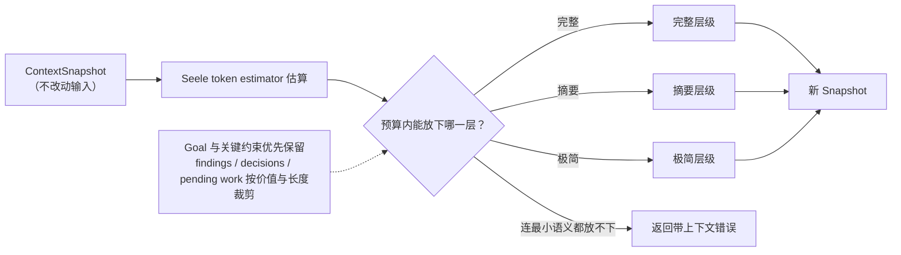

# Context Compactor

## 生态位

Compactor 在给定 token budget 内压缩 `ContextSnapshot`，用于子 Agent、A2A 和长会话上下文注入。

## 数据流图



## 策略

压缩复用 Seele token estimator，并根据预算选择完整、摘要或极简层级。Goal 和关键约束优先保留，findings/decisions/pending work 按价值和长度裁剪。

返回新 Snapshot，不修改输入；无法在预算内保留最小语义时返回带上下文错误。

## Review

- budget 边界和层级切换是否稳定。
- Unicode 截断是否安全，估算是否与 Seele 一致。
- 关键 goal/constraint 不应被低价值日志挤掉。
- 不要通过删除字段掩盖 escape/error 状态。

## 测试

```text
go test ./seelexctx/compactor -count=1
```
