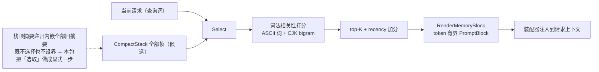

# seelexctx/memory — 历史记忆选取

## 生态位

超长会话里 CompactStack 只渲染栈顶帧（`RenderStackBlocks`），栈顶摘要递归
内嵌全部旧摘要——既不选择也不设界。本包把「从历史 select 出相关过往记忆」
做成显式一步：

```text
查询（当前请求） + CompactStack 全部帧（候选）
  └─ Select：词法相关性打分（ASCII 词 + CJK bigram）→ top-K（recency 加分）
  └─ RenderMemoryBlock：token 有界的「相关记忆」PromptBlock（装配器注入）
```

## 数据流图



## 契约

| 符号 | 语义 |
|---|---|
| `Candidate` | 一条记忆：SegmentID + Summary + Evidence（压缩帧映射） |
| `Select(query, candidates, opts)` | 纯函数：命中降序 top-K；空查询/无命中 → nil |
| `RenderMemoryBlock(selected, maxTokens)` | 有界块；预算默认 1024 tokens |

## 设计原则

- **确定性**：词法打分（术语频次加权），零外部依赖、可单测断言顺序。
- **有界**：渲染块逐条按预算截断，绝不无界拼接（替代栈顶递归内嵌）。
- **可替换**：`Select` 输入输出为纯数据结构；graph role 向量检索可用后
  以同签名实现替换（docs/plan/memory-architecture.md），装配点不变。
- **不伪造事实**：块内显式声明排序分数不作为事实，证据指向不可变句柄。

## 测试

```text
go test ./seelexctx/memory -count=1
```
