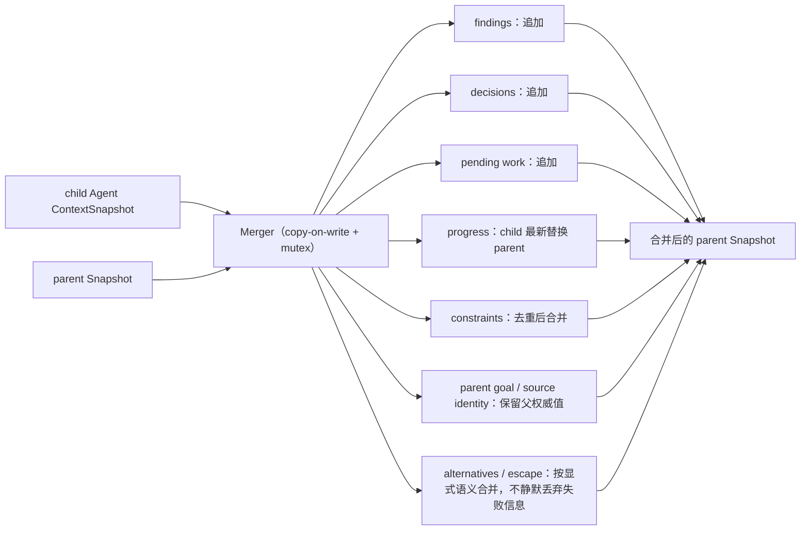

# Context Merger

## 生态位

Merger 把 child Agent 的结构化结果合并回 parent Snapshot，形成 A2A 闭环。

## 数据流图



并发分支不会就地修改同一 parent 对象：写入走 copy-on-write，读侧由 mutex 保护。

## 合并语义

- findings、decisions、pending work：追加。
- progress：child 的最新进度替换 parent progress。
- constraints：去重后合并。
- parent goal/source identity：保留父上下文权威值。
- alternatives/escape：按显式语义合并，不静默丢弃失败信息。

实现使用 copy-on-write 和 mutex，避免并发分支修改同一 parent 对象。

## Review

- 合并顺序是否会导致非确定结果。
- 去重是否只按文本，是否需要未来稳定 ID。
- child 不应覆盖 parent identity/goal。
- 失败/escape 分支是否仍可被上层观察。

## 测试

```text
go test ./seelexctx/merger -count=1
```
