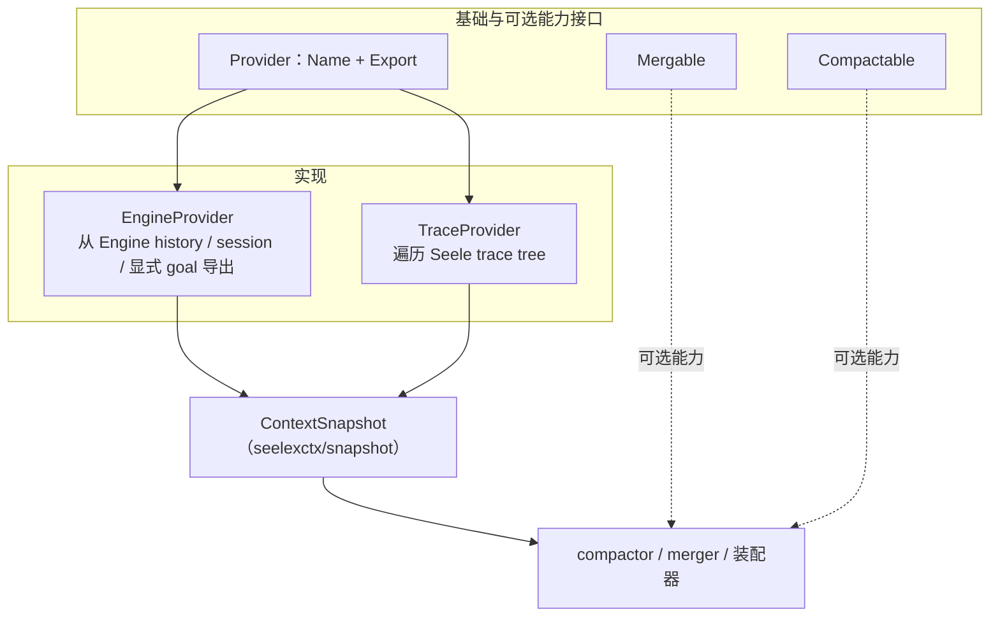

# Context Providers

## 生态位

Provider 把不同运行时事实源转换为统一 `ContextSnapshot`。

## 架构图



TraceProvider 提取 LLM 文本、tool decision、错误、token 与进度；两者都**不修改**
Engine history 或 trace tree。

## 实现

- `Provider`：`Name` + `Export` 基础接口。
- `Mergable`/`Compactable`：可选能力接口。
- `EngineProvider`：从 Engine history、session 和显式 goal 导出上下文。
- `TraceProvider`：遍历 Seele trace tree，提取 LLM 文本、tool decision、错误、token 和进度。

## Review

- provider 不应修改 Engine history 或 trace tree。
- nil Engine、空 history、未知 trace node 和无效 token 必须安全处理。
- Tool args/result 可能含秘密或大文本，导出前应限制和清洗。
- 新事实源实现同一接口，不在调用方加入类型 switch。

## 测试

```text
go test ./seelexctx/provider -count=1
```
