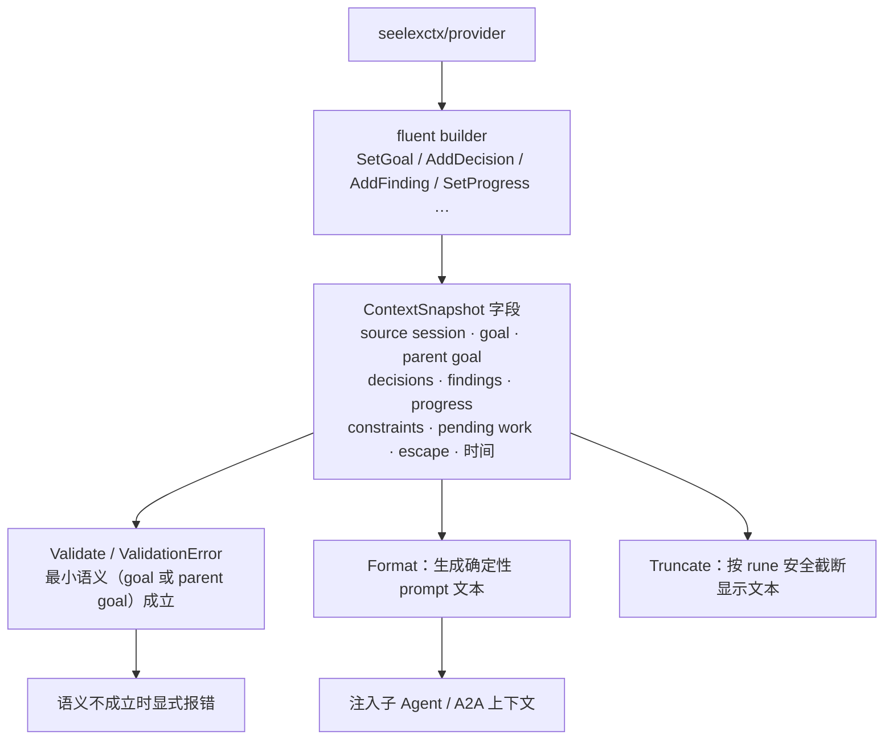

# Context Snapshot

## 生态位

本包定义跨 Agent 上下文的稳定结构：source session、goal、parent goal、decisions、findings、progress、constraints、pending work、escape 信息和时间。

## 架构图



## 核心实现

- `ContextSnapshot`：结构化上下文事实。
- fluent builder：`SetGoal`、`AddDecision`、`AddFinding`、`SetProgress` 等。
- `Format`：生成可注入 prompt 的确定性文本。
- `Validate`/`ValidationError`：确保 goal 或 parent goal 等最小语义成立。
- `Truncate`：按 rune 安全截断显示文本。

## 边界与 Review

Snapshot 是数据对象，不读取 Engine 或执行压缩。字段新增需同步 provider、compactor、merger 和 format tests。Format 输出顺序是 prompt 契约，不应随 map 顺序变化；用户文本必须与结构标题清楚分隔。

## 测试

```text
go test ./seelexctx/snapshot -count=1
```
