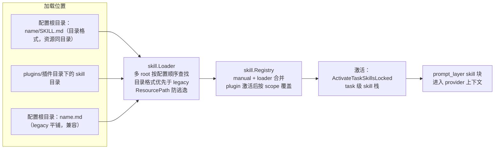

# Skill Runtime

## 模块定位

`skill` 加载目录化 Skill、解析 `SKILL.md`、限制资源路径，并根据当前 Plugin 计算可见 Skill 集合。

## 文件结构

- `loader.go`：多 root 查找、目录/legacy flat-file 兼容、create/delete 和 plugin-dir load。
- `skill.go`：`Skill` 模型、`ResourcePath` 安全解析和线程安全 Registry。

## 加载与优先级

标准格式为 `<root>/<name>/SKILL.md`，资源与脚本留在同一目录。Loader root 按配置顺序优先；目录格式优先于 legacy `<name>.md`。

Registry 合并 manual 与 loader skills；激活 Plugin 后，只暴露该 Plugin 发布的 skills。Plugin skill 同名覆盖由 plugin scope 决定，不污染 global registry。

## 安全边界

`ResourcePath` 拒绝绝对路径和 `..` 逃逸。Skill 名称必须满足安全模式。删除只作用于 Loader primary root 下解析出的目标。

## Review 指南

- reload 是否保留 manual skills，并按 root priority 确定性覆盖。
- plugin activate/deactivate 是否原子切换可见集合。
- front matter body 是否完整保留，resource path 是否 canonical 后再比较。
- 新格式必须保留已有 Skill 的向后兼容或提供迁移。

## Skill 加载位置（Mermaid）



- 标准格式 `<root>/<name>/SKILL.md`，资源与脚本留在同一 Skill 目录（不跨根引用）；`<root>/<name>.md` 为 legacy 兼容。
- loader root 按配置顺序优先；目录格式优先于 legacy；plugin skill 只在插件激活后可见且不污染 global registry。
- 加载后进入 `skill.Registry`，任务激活时经 `ActivateTaskSkillsLocked` 注入 `prompt_layer` 的 skill 块。

## 测试

```text
go test ./skill -count=1
go test ./plugin -count=1
```
