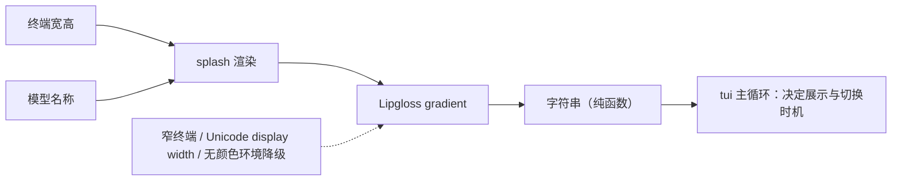

# TUI Splash

## 生态位

`splash` 是 TUI 启动画面的纯渲染模块，使用 Lipgloss gradient 根据终端宽高和模型名称生成字符串。

它不读取 Application 状态、不执行 IO，也不控制启动时长。调用方负责何时展示和切换到主界面。

## 数据流图

Review 时关注窄终端、Unicode display width、颜色 profile 和无颜色环境的降级。验证随 `go test ./tui/...` 和手工终端 smoke 完成。
