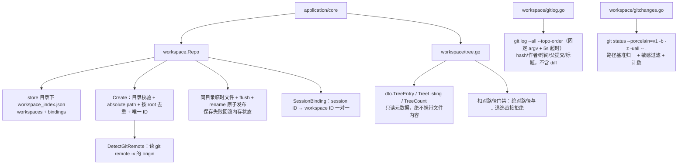
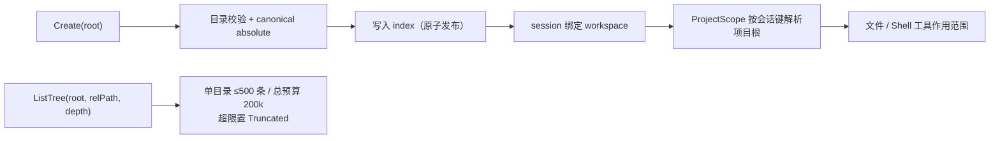

# Workspace Repository

## 生态位

`workspace` 管理 Seelex 项目定义及 session-to-workspace binding。项目的作用是限制 session 的文件读写范围；conversation history 仍由 sessionstore 独立保存。

## 架构图



名称允许重复，ID 才是唯一索引；显示名默认取 `RootPath` basename。

## 数据流图



## 数据模型

- `Info`：opaque unique `ID`、持久化名称、absolute `RootPath`、Git remote 和创建时间。
- `SessionBinding`：session ID 到 workspace ID 的一对一绑定。
- `repoSnapshot`：`workspace_index.json` 中的 workspaces + bindings。
- `dto.TreeEntry`/`TreeListing`/`TreeCount`：工作树只读元数据 DTO（名称/相对
  路径/类型/大小/直接文件计数；绝不携带文件内容），定义在
  `application/contract/dto/tree.go`，由 `workspace/tree.go` 产出。
- `dto.GitLogResult`/`GitCommitNode`：提交记录只读元数据（hash/短 hash/作者/
  时间/父提交/标题，无 diff），同一文件定义、由 `workspace/gitlog.go` 产出。
- `dto.WorkspaceChangeEntry`/`WorkspaceChangesResult`：未提交改动只读元数据
  （Kind 分类 + porcelain XY 两字符 + 路径 + 重命名原路径 + 统计），定义在
  `application/contract/dto/gitchanges.go`，由 `workspace/gitchanges.go` 产出。

对外适配器会把 `RootPath` basename 作为显示名称；持久化 `Name` 只作为兼容 fallback。名称允许重复，ID 才是唯一索引。

## 生命周期

- `NewRepo`：内存模式。
- `NewRepoWithStore`：加载 `<store>/workspace_index.json`。
- Create 校验目录、转 absolute path、按 root 去重并生成唯一 ID。
- mutation 自动保存 index；持久化使用同目录临时文件、flush 和 rename 原子发布。Create/Delete/UpdateGitRemote 在保存失败时回滚内存状态；Delete 同时清理指向该 workspace 的 bindings。
- `DetectGitRemote` 只读取 `git remote -v` 的 origin。

## 工作树查询（tree.go）

- `ListTree(root, relPath, depth)`：列出根内某目录的子条目（dir-first 排序、
  单目录条目 ≤500、总读取预算 200k，超限置 `Truncated`）。客户端只允许相对
  路径，绝对路径与 `..` 逃逸直接拒绝（Windows 大小写不敏感 containment）。
- `CountFiles(root)`：递归统计文件/目录数（同一预算与忽略规则）。
- 默认忽略目录：`.git`、`.seelex`、`dist`、`node_modules`、`.venv`、`tmp`、
  `.idea`、`__pycache__`；敏感文件名 `accounts.yaml` 与 `*.local.yaml` 只
  元数据也不展示/统计（防真实账号配置暴露）。
- 遍历不跟随符号链接（防环、防逃逸）；权限/IO 错误目录按 best-effort 跳过。
- Repo 实现 `contract.WorkspaceTreePort`（optional 端口），Application 经
  类型断言启用；GUI Bridge 暴露 `WorkspaceTree`/`WorkspaceFileCount`。

## Git 只读查询（gitlog.go / gitchanges.go）

两块能力与工作树同级：只读、固定 argv（不经过 shell）、带超时、路径与状态之外的
一切（diff、补丁、文件内容、blob）都不下发；非 git 仓库以 `Result.Error` 返回展示
文案，不当作 Go error 中断调用。

- `GitLog(root, limit)`：`git log --all --topo-order`，`\x01` 分隔取
  `%H %h %an %ad %P %s`（主题放最后故可含任意字符）；limit 默认 20、上限 200。
- `GitChanges(root, limit)`：`git --no-optional-locks status --porcelain=v1 -b -z
  -uall -- .`。`-z` 免去 C 风格引号转义（中文与空格路径原样返回），重命名是
  「新路径 NUL 旧路径」两条记录；`-- .` 把范围钉在工作区子树内；limit 默认 200、
  上限 1000，解析预算 20000 条。
- **路径基准**：git status 的路径以仓库根为基准，`GitChanges` 按
  `rev-parse --show-toplevel` 剥成工作区根基准（绑定的目录可能是仓库子目录），
  工作区之外的兄弟路径丢弃并计入 `Result.Filtered`。
- **可见性边界**：与 ListTree/ReadFile 一致，路径任一环节命中敏感文件名
  （`accounts.yaml`、`*.local.yaml`）不展示并计入 `Filtered`；目录噪音交给 git
  自己的 `.gitignore`（套用 `ignoreDirNames` 会藏掉被跟踪的 `dist/` 改动）。
- **分类与统计**：porcelain 的 XY 只在 `classifyChange` 一处解释成 `dto.Change*`；
  `Total` 与暂存/未暂存/未跟踪/冲突计数覆盖**过滤后的全部条目**（含被 limit 截断的
  部分），列表截断另由 `Truncated` 表达。
- Repo 实现 `contract.WorkspaceTreePort`，GUI Bridge 暴露 `WorkspaceGitLog` 与
  `WorkspaceChanges`。

## 生态位与边界

Repo 保存项目目录和关系，但不执行 PathGate、文件工具或 session history IO。Runtime 的 ProjectScope 由 Application 在 bind/resume 时同步。

## Review 指南

- 不以显示名称查找或覆盖项目。
- root dedup 应处理 clean/absolute/case/volume 语义，跨平台时特别注意 Windows 大小写。
- binding mutation 的公开接口目前没有 error 返回值，因此 Bind/Unbind 的持久化失败仍是 best-effort；如果这条契约升级，必须同步修改 Application port。
- Git remote 命令必须只读且有退出边界。

## 测试

```text
go test . -run Workspace -count=1
go test ./application/core -run Workspace -count=1
```

`tree_test.go` 覆盖排序/计数、忽略与敏感过滤、逃逸拒绝、预算截断与嵌套深度。
`gitlog_test.go` 覆盖 `\x01` 字段解析、父提交顺序、主题含分隔符与截断。
`gitchanges_test.go` 覆盖 `-z` 记录解析（含重命名两条记录、裸中文/空格路径、
畸形记录、解析预算）、XY 分类、分支头归一化、路径基准剥离与越界丢弃、敏感过滤与
limit 截断，并有真实 git 仓库的集成用例（改动/暂存/删除/重命名/未跟踪、仓库子目录
即工作区根、非 git 目录返回 `Result.Error`）。
